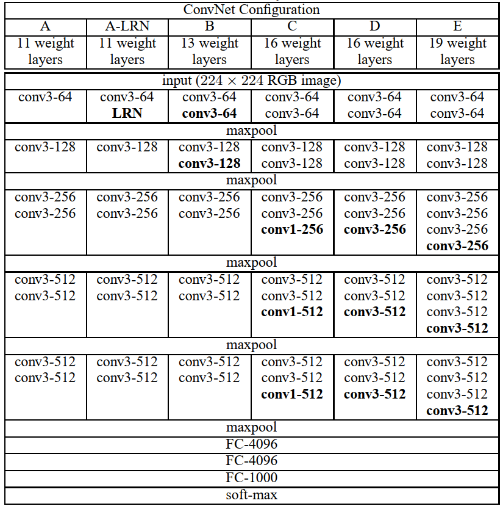
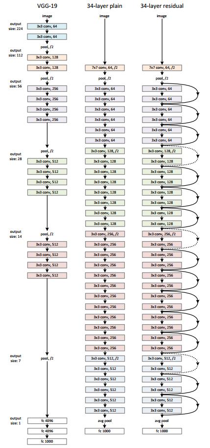
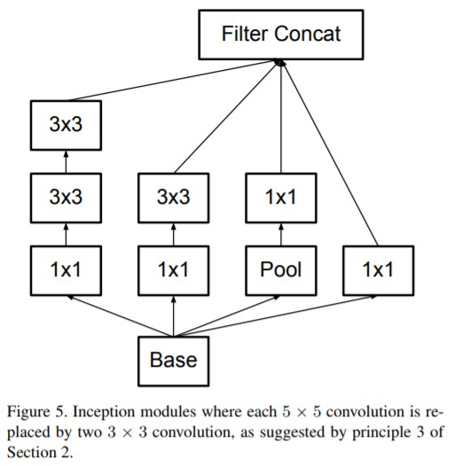
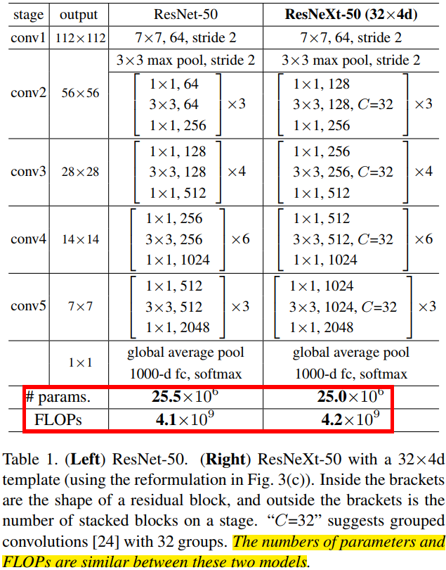
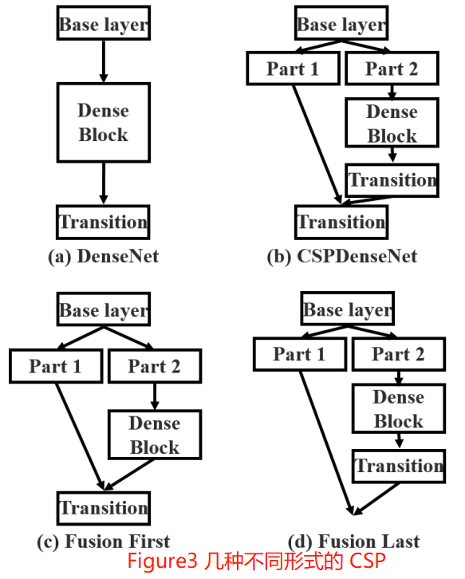

- [VGG](#vgg)
- [ResNet](#resnet)
- [Inceptionv3](#inceptionv3)
- [ResNeXt](#resnext)
- [CSPNet](#cspnet)
- [参考资料](#参考资料)

## VGG

`VGG`网络结构参数表如下图所示。

## ResNet

`ResNet` 模型比 `VGG` 网络具有更少的滤波器数量和更低的复杂性。 比如 `Resnet34` 的 `FLOPs` 为 `3.6G`，仅为 `VGG-19` `19.6G` 的 `18%`。
> 注意，论文中算的 `FLOPs`，把乘加当作 `1` 次计算。

`ResNet` 和 `VGG` 的网络结构连接对比图，如下图所示。

`Resnet` 网络参数表如下图所示。

## Inceptionv3

常见的一种 `Inception Modules` 结构如下：

## ResNeXt

ResNeXt 的卷积 block 和 Resnet 对比图如下所示。

ResNeXt和Resnet的模型结构参数对比图如下图所示。

## CSPNet

`CSP` 方法可以减少模型计算量和提高运行速度的同时，还不降低模型的精度，是一种更高效的网络设计方法，同时还能和 `Resnet`、`Densenet`、`Darknet` 等 `backbone` 结合在一起。

## 参考资料

+ `VGG/ResNet/Inception/ResNeXt/CSPNet` 论文