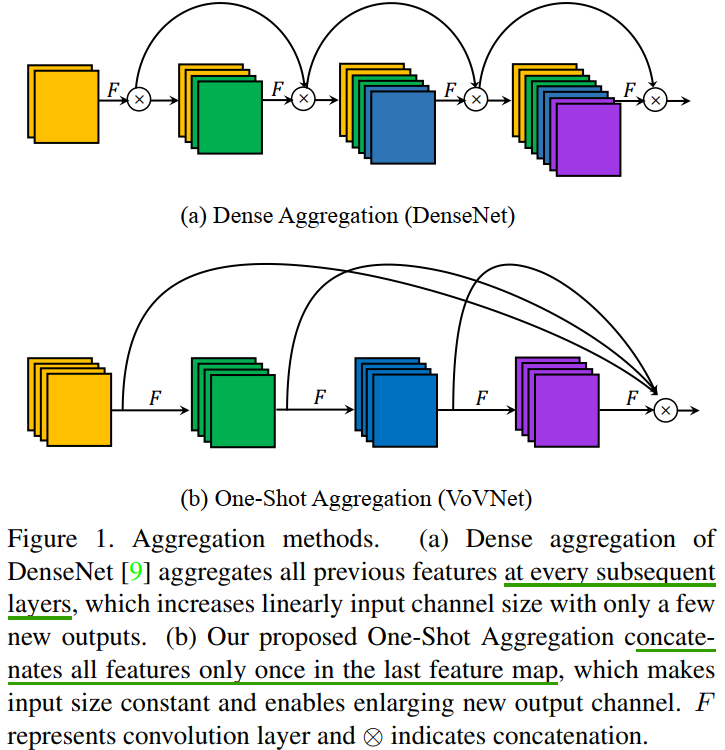
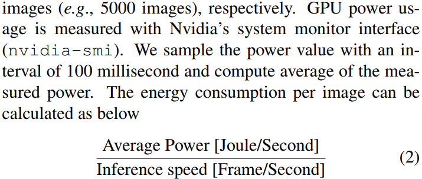
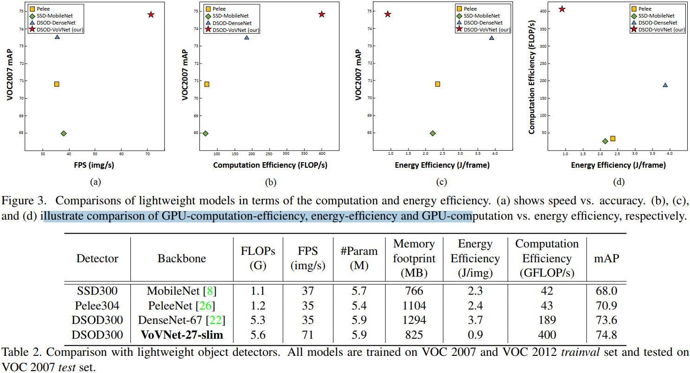
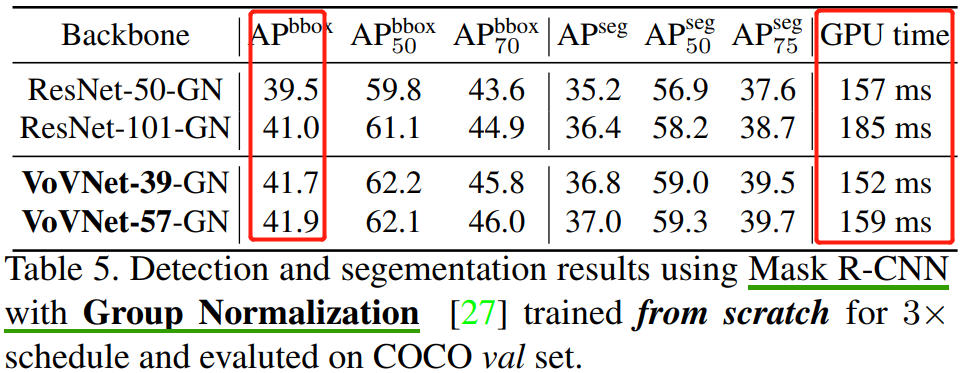

- [摘要](#摘要)
- [1，介绍](#1介绍)
- [2，高效网络设计的影响因素](#2高效网络设计的影响因素)
  - [2.1，内存访问代价](#21内存访问代价)
  - [2.2，GPU计算效率](#22gpu计算效率)
- [3，建议的方法](#3建议的方法)
  - [3.1，重新思考密集连接](#31重新思考密集连接)
  - [3.2，One-Shot Aggregation](#32one-shot-aggregation)
  - [3.3，构建 VoVNet 网络](#33构建-vovnet-网络)
- [4，实验](#4实验)
- [参考资料](#参考资料)

## 摘要

> `Youngwan Lee*` 作者于 `2019` 年发表的论文 An Energy and GPU-Computation Efficient Backbone Network for Real-Time Object Detection.

因为 `DenseNet` 通过用密集连接，来聚合具有不同感受野大小的中间特征，因此它在对象检测任务上上表现出良好的性能。虽然特征重用（`feature reuse`）的使用，让 `DenseNet` 以少量模型参数和 `FLOPs`，也能输出有力的特征，但是使用 `DenseNet` 作为 `backbone` 的目标检测器却表现出了运行速度慢和效率低下的弊端。作者认为是密集连接(`dense connection`)带来的输入通道线性增长，从而导高内存访问成本和能耗。为了提高 `DenseNet` 的效率，作者提出一个新的更高效的网络 `VoVet`，由 `OSA`（`One-Shot Aggregation`，一次聚合）组成。`OSA` **仅在模块的最后一层聚合前面所有层的特征**，这种结构不仅继承了 `DenseNet` 的多感受野表示多种特征的优点，也解决了密集连接效率低下的问题。基于 `VoVNet` 的检测器不仅速度比 `DenseNet` 快 2 倍，能耗也降低了 1.5-4.1 倍。另外，`VoVNet` 网络的速度和效率还优于 `ResNet`，并且其对于小目标检测的性能有了显著提高。

## 1，介绍

随着 `CNN` 模型：`VGG`、`ResNet` 和 `DensNet` 的巨大进步，它们开始被广泛用作目标检测器的 `backbone`，用来提取图像特征。

`ResNet` 和 `DenseNet` 主要的区别在于它们聚合特征的方式，`ResNet` 是通过逐元素相加（`element-wise add`）和前面特征聚合，`DenseNet` 则是通过拼接（`concatenation`）的方式。`Zhu` 等人在论文[32](https://arxiv.org/abs/1801.05895) 中认为前面的特征图携带的信息将在与其他特征图相加时被清除。换句话说，通过 `concatenation` 的方式，早期的特征才能传递下去，因为它保留了特征的原始形式（没有改变特征本身）。

最近的一些工作 [25, 17, 13] 表明**具有多个感受野的抽象特征可以捕捉各种尺度的视觉信息**。因为检测任务比分类更加需要多样化尺度去识别对象，因此保留来自各个层的信息对于检测尤为重要，因为网络每一层都有不同的感受野。因此，在目标检测任务上，`DenseNet` 比 `ResNet` 有更好更多样化的特征表示。
> 这是不是说明对于，多标签分类问题，用 VoVNet 作为 backbone，效果要比 ResNet 要好。因为前者可以实现多感受野表示特征。

尽管使用 DenseNet 的检测器的参数量和 FLOPs 都比 ResNet 小，但是前者的能耗能耗和速度却更慢。这是因为，还有其他因素 FLOPs 和模型尺寸（参数量）影响能耗。

首先，**内存访问代价** `MAC` 是影响能耗的关键因素。如图 1(a) 所示，因为 DenseNet 中的所有特征图都被密集连接用作后续层的输入，因此内存访问成本与网络深度成二次方增加，从而导致计算开销和更多的能耗。

其次，关于 **GPU 的并行计算**，DenseNet 有计算瓶颈的限制。一般来说，当操作的张量更大时，GPU 的并行利用率会更高[19,29,13]。
然而，由于为了线性增加输入通道，需要 DenseNet 采用 1×1 卷积 `bottleneck` 架构来减少输入维度和 `FLOPs`，这导致使用较小的操作数张量增加层数。作为结果就是 GPU 计算变得低效。总结就是，`bottleneck` 结构中的 $1\times 1$ 卷积会导致 `GPU` 并行利用率。

本文的目的在于将 DenseNet 改进的更高效，同时，还保留对目标检测有益的连接聚合（`concatenative aggregation`）操作。

> 作者认为 DenseNet 网络 DenseBlock 中间层的密集连接（`dense connections`）会导致网络效率低下，并假设相应的密集连接是多余的。

作者使用 `OSA` 模块构建了 `VoVNet` 网络，为了验证有效性，将其作为 DSOD、RefineDet 和 Mask R-CNN 的 backbone 来做对比实验。实验结果表明，基于 VoVNet 的检测器优于 DenseNet 和 ResNet，速度和能耗都更优。

## 2，高效网络设计的影响因素

作者认为，MobileNet v1 [8], MobileNet v2 [21], ShuffleNet v1 [31], ShuffleNet v2 [18], and Pelee 模型主要是通过使用 `DW` 卷积和 带 $1\times 1$ 卷积的 `bottleneck` 结构来减少 `FLOPs` 和模型尺寸（参数量）。
> 这里我觉得作者表达不严谨，因为 shufflenetv2 在论文中已经声明过，FLOPs 和模型参数量不是模型运行速度的唯一决定因素。

实际上，减少 `FLOPs` 和模型大小并不总能保证减少 GPU 推理时间和实际能耗，典型的例子就是 `DenseNet` 和 `ResNet` 的对比，还有就是在 GPU 平台上， Shufflenetv2 在同等参数条件下，运行速度比 MobileNetv2 更快。这些现象告诉我们，`FLOPs` 和 模型尺寸（参数）是衡量模型实用性（`practicality`）的间接指标。为了设计更高效的网络，我们需要使用直接指标 `FPS`，除了上面说的 `FLOPs` 和模型参数量会影响模型的运行速度（`FPS`），还有以下几个因素。

### 2.1，内存访问代价

这个 Shufflenetv2 作者已经解释得很清楚了，本文的作者的描述基本和 Shufflenetv2 一致。我这里直接给结论：

- `MAC` 对能耗的影响超过了计算量 `FLOPs` [28]。
- 卷积层输入输出通道数相等时，`MAC` 取得最小值。
- 即使模型参数量一致，只要 MAC 不同，那么模型的运行时间也是不一致的(ShuffleNetv2 有实验证明)。

> 论文 [28] Designing energy-efficient convolutional neural networks using energyaware pruning.

### 2.2，GPU计算效率

> 其实这个内容和 shufflenetv2 论文中的 G3 原则（网络碎片化会降低 GPU 并行度）基本一致。

**为提高速度而降低 `FLOPs` 的网络架构基于这样一种理念，即设备中的每个浮点运算都以相同的速度进行处理**。但是，当模型部署在 `GPU` 上时，不是这样的，因为 GPU 是并行处理机制能同时处理多个浮点运算进程。我们用 GPU 计算效率来表示 GPU 的运算能力。

- 通过减少 `FLOPs` 是来加速的前提是，设备中的每个浮点运算都以相同的速度进行处理；
- **GPU 特性**：
  - 擅长 `parallel computation`，`tensor` 越大，`GPU` 使用效率越高。
  - 把大的卷积操作拆分成碎片的小操作将不利于 `GPU` 计算。
- 因此，设计 `layer` 数量少的网络是更好的选择。`MobileNet`使用额外的 1x1 卷积来减少计算量，不过这不利于 GPU 计算。
- 为了衡量 GPU 利用率，引入有一个新指标：$FLOP/s = \frac{FLOPs}{GPU\ inference\ time}$（每秒完成的计算量 `FLOPs per Second`），FLOP/s 高，则 `GPU` 利用率率也高。

## 3，建议的方法

### 3.1，重新思考密集连接

- 密集连接会增加输入通道大小，但输出通道大小保持不变，因此，每层都有不相等的输入和输出通道数。因此，DenseNet 具有具有较高的 MAC。
- DenseNet 采用了 `bottleneck` 结构，这种结构将一个 $3\times 3$ 卷积分成了两个计算（1x1+3x3 卷积），这带来了更多的序列计算（sequential computations），从而降低推理速度。

OSA 把中间的密集连接都去掉了，各个卷积层之间的相互关系图是图 7 的下面第 2 行，可以看到蓝色的部分 (联系大部分不紧密的部分) 明显减少了很多，也就是说 OSA 模块的每个连接都是相对有用的。

上图分析了 DenseNet 中，浅层 feature map 对深层 feature map 的贡献。可以看出，前者对后者的贡献很少。所以我们提出假设 1：中间层聚合能力和最后层的聚合能力成反比。也就是说，中间层特征层对的聚合能力越好，那么最后的 feature map 的聚合能力就越弱。

因此，让中间的 feature maps 的聚合能力弱化或者减少其相关性，会更利于最后feature map 表达能力的提升。因为可以进一步提出假设 2，**相比于它们造成的损耗而言，中间特征层的 dense connection 并不重要**。为了验证假设，我们重新设计了一个新模块，该模块仅在每个块的最后一层聚合其中间特征。

### 3.2，One-Shot Aggregation

`OSA` 模块的结构图如图 1(b) 所示。

在 OSA 模块中，每一层产生两种连接，一种是通过 conv 和下一层连接，产生 `receptive field` 更大的 `feature map`，另一种是和最后的输出层相连，以聚合足够好的特征。

为了验证 OSA 模块的有效性，作者使用 dense block 和 OSA 模块构成 DenseNet-40网络，使两种模型参数量一致，做对比实验。OSA 模板版本在 CIFAR-10 数据集上的精度达到了 `93.6`，和 dense block 版本相比，只下降了 `1.2%`。再根据 MAC 的公式，可知 MAC 从 3.7M 减少为 2.5M。`MAC` 的降低是因为 OSA 中的中间层具有相同大小的输入输出通道数，从而使得 MAC 可以取最小值（`lower boundary`）。

因为 OSA 模块中间层的输入输出通道数一致，所以没必要使用 `bottleneck` 结构，这又进一步提高了 GPU 利用率。

### 3.3，构建 VoVNet 网络

因为 `OSA` 模块的多样化特征表示和效率，所以可以通过**仅堆叠几个模块**来构建精度高、速度快的 `VoVNet` 网络。基于图 2 中浅层深度更容易聚合的认识，作者认为可以配置比 `DenseNet` 具有更大通道数的但更少卷积层的 `OSA` 模块。

如下图所示，分别构建了 VoVNet-27-slim，VoVNet-39， VoVNet-57。注意，其中downsampling 层是通过 3x3 stride=2 的 max pooling 实现的，conv 表示的是 Conv-BN-ReLU 的顺序连接。

 VOVNet 由 5 个阶段组成，各个阶段的输出特征大小依次降为原来的一半。VOVNet-27 前 2 个 stage 的连接图如下所示。

## 4，实验

GPU 的能耗计算公式如下：

**实验1： VoVNet vs. DenseNet. 对比不同 backbone 下的目标检测模型性能(PASCALVOC)**

对比指标：

- Flops：模型需要的计算量
- FPS：模型推断速度img/s
- Params：参数数量
- Memory footprint：内存占用
- Enegry Efficiency：能耗
- Computation Efficiency：GPU 计算效率（GFlops/s）
- mAP（目标检测性能评价指标）

- **现象 1**：相比于 DenseNet-67，PeleeNet 减少了 Flops，但是推断速度没有提升，与之相反，VoVNet-27-slim 稍微增加了Flops，而推断速度提升了一倍。同时，VoVNet-27-sli m的精度比其他模型都高。
- **现象 2**：VoVNet-27-slim 的内存占用、能耗、GPU 利用率都是最高的。
- **结论 1**：相比其他模型，**VoVNet做到了准确率和效率的均衡，提升了目标检测的整体性能**。

**实验2：Ablation study on 1×1 conv bottleneck.**

结论 2：可以看出，1x1 bottleneck 增加了 GPU Inference 时间，降低了 mAP，尽管它减少了参数数量和计算量。

因为 1x1 bottleneck 增加了网路的总层数，需要更多的激活层，从而增加了内存占用。

**实验3： GPU-Computation Efficiency.**

- 图3(a) VoVNet 兼顾准确率和 Inference 速度
- 图3(b) VoVNet 兼顾准确率和 GPU 使用率
- 图3(c) VoVNet 兼顾准确率和能耗
- 图3(d) VoVNet 兼顾能耗和 GPU 使用率

**实验室4：基于RefineDet架构比较VoVNet、ResNet和DenseNet**。

**结论 4**：从 COCO 数据集测试结果看，相比于 ResNet，VoVnet在 Inference 速度，内存占用，能耗，GPU 使用率和准确率上都占据优势。尽管很多时候，VoVNet 需要更多的计算量以及参数量。

- 对比 DenseNet161(k=48) 和 DenseNet201(k=32)可以发现，深且”瘦“的网络，GPU 使用率更低。
- 另外，作者发现**相比于 ResNet，VoVNet 在小目标上的表现更好**。

**实验 5：Mask R-CNN from scratch.**

通过替换 Mask R-CNN 的 backbone，也发现 VoVNet 在Inference 速度和准确率上优于 ResNet。

## 参考资料

- [论文笔记VovNet（专注GPU计算、能耗高效的网络结构）](https://zhuanlan.zhihu.com/p/79677425)
- [An Energy and GPU-Computation Efficient Backbone Network
for Real-Time Object Detection](https://arxiv.org/abs/1904.09730)
- [实时目标检测的新backbone网络：VOVNet](https://zhuanlan.zhihu.com/p/393740052)