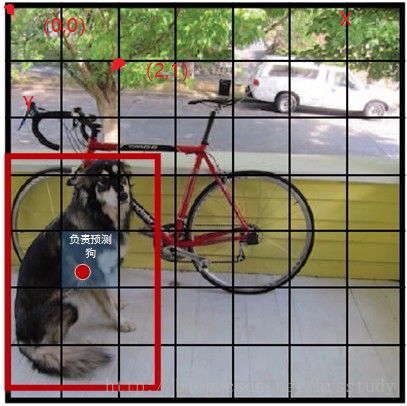
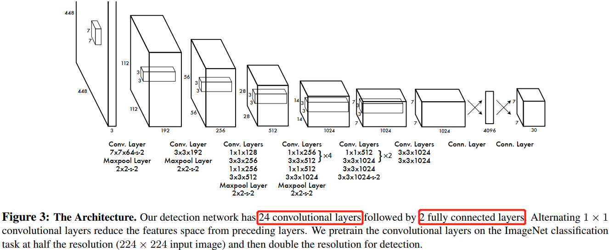
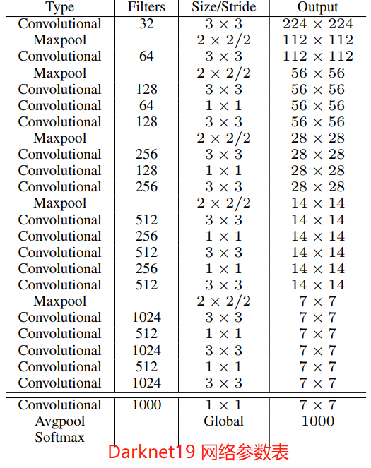
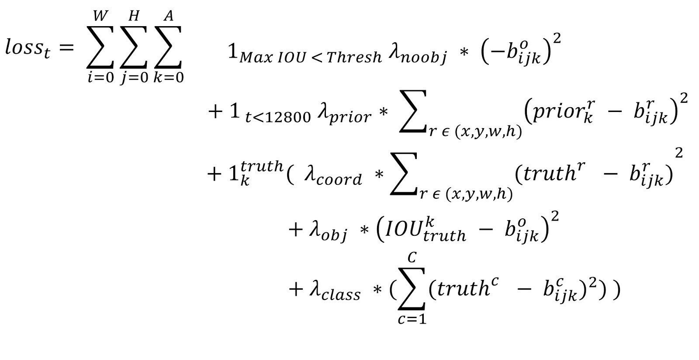
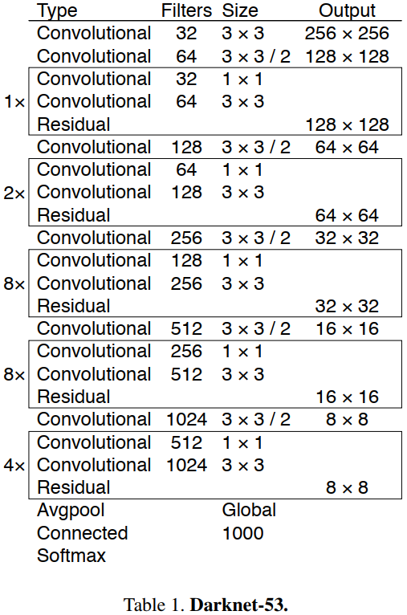
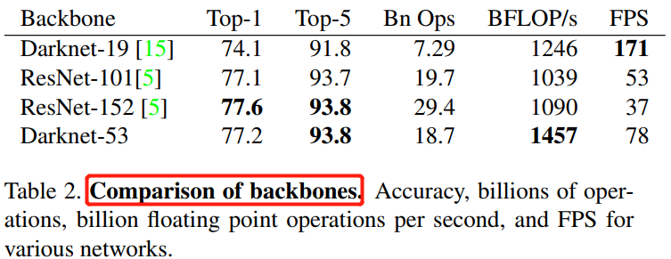
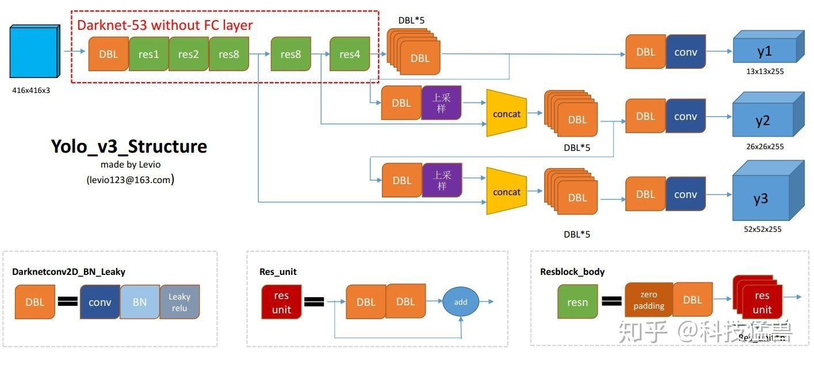

- [一，YOLOv1](#一yolov1)
  - [Abstract](#abstract)
  - [1. Introduction](#1-introduction)
  - [2. Unified Detectron](#2-unified-detectron)
    - [2.1. Network Design](#21-network-design)
    - [2.2 Training](#22-training)
    - [2.4. Inferences](#24-inferences)
    - [4.1 Comparison to Other Real-Time Systems](#41-comparison-to-other-real-time-systems)
  - [5，代码实现思考](#5代码实现思考)
- [二，YOLOv2](#二yolov2)
  - [摘要](#摘要)
  - [YOLOv2 的改进](#yolov2-的改进)
    - [1，中心坐标位置预测的改进](#1中心坐标位置预测的改进)
    - [2，1 个 gird 只能对应一个目标的改进](#21-个-gird-只能对应一个目标的改进)
    - [3，backbone 的改进](#3backbone-的改进)
    - [4，多尺度训练](#4多尺度训练)
  - [损失函数](#损失函数)
- [三，YOLOv3](#三yolov3)
  - [摘要](#摘要-1)
  - [1，介绍](#1介绍)
  - [2，改进](#2改进)
    - [2.1，边界框预测](#21边界框预测)
    - [2.2，分类预测](#22分类预测)
    - [2.3，跨尺度预测](#23跨尺度预测)
    - [2.4，新的特征提取网络](#24新的特征提取网络)
    - [2.5，训练](#25训练)
  - [3，实验结果](#3实验结果)
  - [4，失败的尝试](#4失败的尝试)
  - [5，改进的意义](#5改进的意义)
- [参考资料](#参考资料)

## 一，YOLOv1
YOLOv1 出自 2016 CVPR 论文 You Only Look Once:Unified, Real-Time Object Detection.

### Abstract

作者提出了一种新的目标检测方法 `YOLO`，之前的目标检测工作都是重新利用分类器来执行检测。作者的神经网络模型是端到端的检测，一次运行即可同时得到所有目标的边界框和类别概率。

`YOLO` 架构的速度是非常快的，`base` 版本实时帧率为 `45` 帧，`smaller` 版本能达到每秒 `155` 帧，性能由于 `DPM` 和 `R-CNN` 等检测方法。

### 1. Introduction

之前的目标检测器是重用分类器来执行检测，为了检测目标，这些系统在图像上不断遍历一个框，并利用分类器去判断这个框是不是目标。像可变形部件模型（`DPM`）使用互动窗口方法，其分类器在整个图像的均匀间隔的位置上运行。

**作者将目标检测看作是单一的回归问题，直接从图像像素得到边界框左边和类别概率**。

YOLO 检测系统如图 1 所示。单个检测卷积网络可以同时预测多个目标的边界框和类别概率。`YOLO` 和传统的目标检测方法相比有诸多优点。


首先，`YOLO` 速度非常快，我们将检测视为**回归**问题，所以检测流程也简单。其次，`YOLO` 在进行预测时，会对图像进行全面地推理。第三，`YOLO` 模型具有泛化能力，其比 `DPM` 和`R-CNN` 更好。最后，虽然 `YOLO` 模型在精度上依然落后于最先进（state-of-the-art）的检测系统，但是其速度更快。

### 2. Unified Detectron

`YOLO` 系统将输入图像划分成 $S\times S$ 的网格（`grid`），然后让每个`gird` 负责检测那些中心点落在 `grid` 内的目标。

**检测任务**：每个网络都会预测 $B$ 个边界框及边界框的置信度分数，所谓置信度分数其实包含两个方面：一个是边界框含有目标的可能性，二是边界框的准确度。前者记为 $Pr(Object)$，当边界框包含目标时，$Pr(Object)$ 值为 `1`，否则为 `0`；后者记为 $IOU_{pred}^{truth}$，即预测框与真实框的 `IOU`。因此形式上，我们将置信度定义为 $Pr(Object)*IOU_{pred}^{truth}$。如果 `grid` 不存在目标，则置信度分数置为 `0`，否则，置信度分数等于预测框和真实框之间的交集（`IoU`）。

每个边界框（`bounding box`）包含 `5` 个预测变量：$x$，$y$，$w$，$h$ 和 `confidence`。$(x,y)$ 坐标不是边界框中心的实际坐标，而是相对于网格单元左上角坐标的**偏移**（需要看代码才能懂，论文只描述了出“相对”的概念）。而边界框的宽度和高度是相对于整个图片的宽与高的比例，因此理论上以上 `4` 预测量都应该在 $[0,1]$ 范围之内。最后，置信度预测表示预测框与实际边界框之间的 `IOU`。
> 值得注意的是，中心坐标的预测值 $(x,y)$ 是相对于每个单元格左上角坐标点的偏移值，偏移量 = 目标位置 - grid的位置。


**分类任务**：每个网格单元（`grid`）还会预测 $C$ 个类别的概率 $Pr(Class_i)|Object)$。`grid` 包含目标时才会预测 $Pr$，且只预测一组类别概率，而不管边界框 $B$ 的数量是多少。

在推理时，我们乘以条件概率和单个 `box` 的置信度。

$$Pr(Class_i)|Object)*Pr(Object)*IOU_{pred}^{truth} = Pr(Class_i)*IOU_{pred}^{truth}$$

它为我们提供了每个框特定类别的置信度分数。这些分数编码了该类出现在框中的概率以及预测框拟合目标的程度。

在 `Pscal VOC` 数据集上评测 `YOLO` 模型时，我们设置 $S=7$, $B=2$（即每个 `grid` 会生成 `2` 个边界框）。`Pscal VOC` 数据集有 `20` 个类别，所以 $C=20$。所以，模型最后预测的张量维度是 $7 \times 7\times (20+5*2) = 1470$。


**总结**：`YOLO` 系统将检测建模为回归问题。它将图像分成 $S \times S$ 的 `gird`，每个 `grid` 都会预测 $B$ 个边界框，同时也包含 $C$ 个类别的概率，这些预测对应的就是 $S \times S \times (C + 5*B)$。

这里其实就是在描述 `YOLOv1` 检测头如何设计：回归网络的设计 + 训练集标签如何构建（即 `yoloDataset` 类的构建），下面给出一份针对 `voc` 数据集编码为 `yolo` 模型的输入标签数据的函数，读懂了这个代码，就能理解前面部分的描述。
> 代码来源[这里](https://github.com/FelixFu520/yolov1)。

```python
def encoder(self, boxes, labels):
    '''
    boxes (tensor) [[x1,y1,x2,y2],[]] 目标的边界框坐标信息
    labels (tensor) [...] 目标的类别信息
    return 7x7x30
    '''
    grid_num = 7 # 论文中设为7
    target = torch.zeros((grid_num, grid_num, 30))  # 和模型输出张量维尺寸一样都是 14*14*30
    cell_size = 1./grid_num  # 之前已经把目标框的坐标进行了归一化（这里与原论文有区别），故这里用1.作为除数
    # 计算目标框中心点坐标和宽高
    wh = boxes[:, 2:]-boxes[:, :2]  
    cxcy = (boxes[:, 2:]+boxes[:, :2])/2  
    # 1，遍历各个目标框；
    for i in range(cxcy.size()[0]):    # 对应于数据集中的每个框 这里cxcy.size()[0] == num_samples
        # 2，计算第 i 个目标中心点落在哪个 `grid` 上，`target` 相应位置的两个框的置信度值设为 `1`，同时对应类别值也置为 `1`；
        cxcy_sample = cxcy[i]  
        ij = (cxcy_sample/cell_size).ceil()-1 # ij 是一个list, 表示目标中心点cxcy在归一化后的图片中所处的x y 方向的第几个网格

        # [0,1,2,3,4,5,6,7,8,9, 10-19] 对应索引 
        # [x,y,w,h,c,x,y,w,h,c, 20 个类别的 one-hot编码] 与原论文输出张量维度各个索引对应目标有所区别
        target[int(ij[1]), int(ij[0]), 4] = 1  # 第一个框的置信度
        target[int(ij[1]), int(ij[0]), 9] = 1  # 第二个框的置信度
        target[int(ij[1]), int(ij[0]), int(labels[i])+9] = 1 # 第 int(labels[i])+9 个类别为 1
        # 3，计算目标中心所在 `grid`（网格）的左上角相对坐标：`ij*cell_size`，然后目标中心坐标相对于子网格左上角的偏移比例 `delta_xy`；
        xy = ij*cell_size  
        delta_xy = (cxcy_sample -xy)/cell_size  
        # 4，最后将 `target` 对应网格位置的 (x, y, w, h) 分别赋相应 `wh`、`delta_xy` 值。
        target[int(ij[1]), int(ij[0]), 2:4] = wh[i]  # 范围为(0,1)
        target[int(ij[1]), int(ij[0]), :2] = delta_xy
        target[int(ij[1]), int(ij[0]), 7:9] = wh[i]
        target[int(ij[1]), int(ij[0]), 5:7] = delta_xy
    return target
```

代码分析，一张图片对应的标签张量 `target` 的维度是 $7 \times 7 \times 30$。然后分别对各个目标框的 `boxes`: $(x1,y1,x2,y2)$ 和 `labels`：`(0,0,...,1,0)`(`one-hot` 编码的目标类别信息）进行处理，符合检测系统要求的输入形式。算法步骤如下：

1. 计算目标框中心点坐标和宽高，并遍历各个目标框；
2. 计算目标中心点落在哪个 `grid` 上，`target` 相应位置的两个框的置信度值设为 `1`，同时对应类别值也置为 `1`；
3. 计算目标中心所在 `grid`（网格）的左上角相对坐标：`ij*cell_size`，然后目标中心坐标相对于子网格左上角的偏移比例 `delta_xy`；
4. 最后将 `target` 对应网格位置的 $(x, y, w, h)$ 分别赋相应 `wh`、`delta_xy` 值。

#### 2.1. Network Design

`YOLO` 模型使用卷积神经网络来实现，卷积层负责从图像中提取特征，全连接层预测输出类别概率和坐标。

`YOLO` 的网络架构受 `GooLeNet` 图像分类模型的启发。网络有 `24` 个卷积层，最后面是 `2` 个全连接层。整个网络的卷积只有 $1 \times 1$ 和 $3 \times 3$ 卷积层，其中 $1 \times 1$ 卷积负责降维 ，而不是 `GoogLeNet` 的 `Inception` 模块。


**图3：网络架构**。作者在 `ImageNet` 分类任务上以一半的分辨率（输入图像大小 $224\times 224$）训练卷积层，但预测时分辨率加倍。

`Fast YOLO` 版本使用了更少的卷积，其他所有训练参数及测试参数都和 `base YOLO` 版本是一样的。

网络的最终输出是 $7\times 7\times 30$ 的张量。这个张量所代表的具体含义如下图所示。对于每一个单元格，前 `20` 个元素是类别概率值，然后 `2` 个元素是边界框置信度，两者相乘可以得到**类别置信度**，最后 `8` 个元素是边界框的 $(x,y,w,h)$ 。之所以把置信度 $c$ 和 $(x,y,w,h)$ 都分开排列，而不是按照$(x,y,w,h,c)$ 这样排列，存粹是为了后续计算时方便。


> 划分 $7 \times 7$ 网格，共 `98` 个边界框，`2` 个框对应一个类别，所以 `YOLOv1` 只能在一个网格中检测出一个目标、最多预测 `49` 个目标。

#### 2.2 Training

> 模型训练最重要的无非就是超参数的调整和损失函数的设计。

因为 `YOLO` 算法将检测问题看作是回归问题，所以自然地采用了比较容易优化的均方误差作为损失函数，但是面临定位误差和分类误差权重一样的问题；同时，在每张图像中，许多网格单元并不包含对象，即负样本（不包含物体的网格）远多于正样本（包含物体的网格），这通常会压倒了正样本的梯度，导致训练早期模型发散。

为了改善这点，引入了两个参数：$\lambda_{coord}=5$ 和 $\lambda_{noobj} =0.5$。对于边界框坐标预测损失（定位误差），采用较大的权重 $\lambda_{coord}  =5$，然后区分不包含目标的边界框和含有目标的边界框，前者采用较小权重 $\lambda_{noobj} =0.5$。其他权重则均设为 `0`。

对于大小不同的边界框，因为较小边界框的坐标误差比较大边界框要更敏感，所以为了部分解决这个问题，将网络的边界框的宽高预测改为对其平方根的预测，即预测值变为 $(x, y, \sqrt w, \sqrt h)$。

`YOLOv1` 每个网格单元预测多个边界框。在训练时，每个目标我们只需要一个边界框预测器来负责。我们指定一个预测器“负责”根据哪个预测与真实值之间**具有当前最高的 `IOU` 来预测目标**。这导致边界框预测器之间的专业化。每个预测器可以更好地预测特定大小，方向角，或目标的类别，从而改善整体召回率。

> `YOLO` 由于每个网格仅能预测 `2` 个边界框且仅可以包含一个类别，因此是对于一个单元格存在多个目标的问题，`YOLO` 只能选择一个来预测。这使得它在预测临近物体的数量上存在不足，如钢筋、人脸和鸟群检测等。

最终网络总的损失函数计算公式如下：


$I_{ij}^{obj}$ 指的是第 $i$ 个单元格存在目标，且该单元格中的第 $j$ 个边界框负责预测该目标。 $I_{i}^{obj}$ 指的是第 $i$ 个单元格存在目标。

+ 前 2 行计算前景的 `geo_loss`（定位 `loss`）。
+ 第 3 行计算前景的 `confidence_loss`（包含目标的边界框的置信度误差项）。
+ 第 4 行计算背景的 `confidence_loss`。
+ 第 5 行计算分类损失 `class_loss`。

值得注意的是，对于不存在对应目标的边界框，其误差项就是只有置信度，坐标项误差是没法计算的。而只有当一个单元格内确实存在目标时，才计算分类误差项，否则该项也是无法计算的。

#### 2.4. Inferences

同样采用了 `NMS` 算法来抑制多重检测，对应的模型推理结果解码代码如下，这里要和前面的 `encoder` 函数结合起来看。

```python
# 对于网络输出预测 改为再图片上画出框及score
def decoder(pred):
    """
    pred (tensor)  torch.Size([1, 7, 7, 30])
    return (tensor) box[[x1,y1,x2,y2]] label[...]
    """
    grid_num = 7
    boxes = []
    cls_indexs = []
    probs = []
    cell_size = 1./grid_num
    pred = pred.data  # torch.Size([1, 14, 14, 30])
    pred = pred.squeeze(0)  # torch.Size([14, 14, 30])
    # 0 1      2 3   4    5 6   7 8   9
    # [中心坐标,长宽,置信度,中心坐标,长宽,置信度, 20个类别] x 7x7
    contain1 = pred[:, :, 4].unsqueeze(2)  # torch.Size([14, 14, 1])
    contain2 = pred[:, :, 9].unsqueeze(2)  # torch.Size([14, 14, 1])
    contain = torch.cat((contain1, contain2), 2)    # torch.Size([14, 14, 2])

    mask1 = contain > 0.1  # 大于阈值, torch.Size([14, 14, 2])  content: tensor([False, False])
    mask2 = (contain == contain.max())  # we always select the best contain_prob what ever it>0.9
    mask = (mask1+mask2).gt(0)

    # min_score,min_index = torch.min(contain, 2) # 每个 cell 只选最大概率的那个预测框
    for i in range(grid_num):
        for j in range(grid_num):
            for b in range(2):
                # index = min_index[i,j]
                # mask[i,j,index] = 0
                if mask[i, j, b] == 1:
                    box = pred[i, j, b*5:b*5+4]
                    contain_prob = torch.FloatTensor([pred[i, j, b*5+4]])
                    xy = torch.FloatTensor([j, i])*cell_size  # cell左上角  up left of cell
                    box[:2] = box[:2]*cell_size + xy  # return cxcy relative to image
                    box_xy = torch.FloatTensor(box.size())  # 转换成xy形式 convert[cx,cy,w,h] to [x1,y1,x2,y2]
                    box_xy[:2] = box[:2] - 0.5*box[2:]
                    box_xy[2:] = box[:2] + 0.5*box[2:]
                    max_prob, cls_index = torch.max(pred[i, j, 10:], 0)
                    if float((contain_prob*max_prob)[0]) > 0.1:
                        boxes.append(box_xy.view(1, 4))
                        cls_indexs.append(cls_index.item())
                        probs.append(contain_prob*max_prob)
    if len(boxes) == 0:
        boxes = torch.zeros((1, 4))
        probs = torch.zeros(1)
        cls_indexs = torch.zeros(1)
    else:
        boxes = torch.cat(boxes, 0)  # (n,4)
        # print(type(probs))
        # print(len(probs))
        # print(probs)
        probs = torch.cat(probs, 0)  # (n,)
        # print(probs)
        # print(type(cls_indexs))
        # print(len(cls_indexs))
        # print(cls_indexs)
        cls_indexs = torch.IntTensor(cls_indexs)  # (n,)
    
    # 去除冗余的候选框，得到最佳检测框（bbox）
    keep = nms(boxes, probs)
    # print("keep:", keep)

    a = boxes[keep]
    b = cls_indexs[keep]
    c = probs[keep]
    return a, b, c
```

#### 4.1 Comparison to Other Real-Time Systems

基于 GPU Titan X 硬件环境下，与他检测算法的性能比较如下。


### 5，代码实现思考

一些思考：快速的阅读了网上的一些 `YOLOv1` 代码实现，发现整个 `YOLOv1` 检测系统的代码可以分为以下几个部分：

- 模型结构定义：特征提器模块 + 检测头模块（两个全连接层）。
- 数据预处理，最难写的代码，需要对原有的 `VOC` 数据做预处理，编码成 `YOLOv1` 要求的格式输入，训练集的 `label` 的 `shape` 为 `(bach_size, 7, 7, 30)`。
- 模型训练，主要由损失函数的构建组成，损失函数包括 `5` 个部分。
- 模型预测，主要在于模型输出的解析，即解码成可方便显示的形式。

## 二，[YOLOv2](http://xxx.itp.ac.cn/pdf/1612.08242.pdf)
> `YOLO9000` 是 `CVPR2017` 的最佳论文提名，但是这篇论文其实提出了 `YOLOv2` 和 `YOLO9000` 两个模型，二者略有不同。前者主要是 `YOLO` 的升级版，后者的主要检测网络也是 `YOLOv2`，同时对数据集做了融合，使得模型可以检测 `9000` 多类物体。

### 摘要

`YOLOv2` 其实就是 `YOLO9000`，作者在 `YOLOv1` 基础上改进的一种新的 `state-of-the-art` 目标检测模型，它能检测多达 `9000` 个目标！利用了多尺度（`multi-scale`）训练方法，`YOLOv2` 可以在不同尺寸的图片上运行，并取得速度和精度的平衡。

在速度达到在 `40 FPS` 同时，`YOLOv2` 获得 `78.6 mAP` 的精度，性能优于`backbone` 为 `ResNet` 的 `Faster RCNN` 和 `SSD` 等当前最优（`state-of-the-art`） 模型。最后作者提出一种联合训练目标检测和分类的方法，基于这种方法，`YOLO9000` 能实时检测多达 `9000` 种目标。

`YOLOv1` 虽然速度很快，但是还有很多缺点：

+ 虽然每个 `grid` 预测两个框，但是只能对应一个目标，对于同一个 `grid` 有着两个目标的情况下，`YOLOv` 是检测不全的，且模型最多检测 $7 \times 7 = 49$ 个目标，即表现为模型查全率低。
+ 预测框不够准确，之前回归 $(x,y,w,h)$ 的方法不够精确，即表现为模型精确率低。
+ 回归参数网络使用全连接层参数量太大，即模型检测头还不够块。

### YOLOv2 的改进

#### 1，中心坐标位置预测的改进

`YOLOv1` 模型预测的边界框中心坐标 $(x,y)$ 是基于 `grid` 的偏移，这里 `grid` 的位置是固定划分出来的，偏移量 = 目标位置 - `grid` 的位置。

**边界框的编码过程**：`YOLOv2` 参考了两阶段网络的 `anchor boxes` 来预测边界框相对先验框的偏移，同时沿用 `YOLOv1` 的方法预测边界框中心点相对于 `grid` 左上角位置的相对偏移值。$(x,y,w,h)$ 的偏移值和实际坐标值的关系如下图所示。


各个字母的含义如下：

+ $b_x,b_y,b_w,b_h$ ：模型预测结果转化为 `box` 中心坐标和宽高后的值
+ $t_x,t_y,t_w,t_h$ ：模型要预测的偏移量。
+ $c_x,c_y$ ：`grid` 的左上角坐标，如上图所示。
+ $p_w,p_h$ ：`anchor` 的宽和高，这里的 `anchor` 是人为定好的一个框，宽和高是固定的。

通过以上定义我们从直接预测位置改为预测一个偏移量，即基于 `anchor` 框的宽高和 `grid` 的先验位置的偏移量，位置上使用 `grid`，宽高上使用 `anchor` 框，得到最终目标的位置，这种方法叫作 `location prediction`。
> 预测偏移不直接预测位置，是因为作者发现直接预测位置会导致神经网络在一开始训练时不稳定，使用偏移量会使得训练过程更加稳定，性能指标提升了 `5%` 左右。

在数据集的预处理过程中，关键的边界框编码函数如下（代码来自 [github](https://github.com/kuangliu/pytorch-yolov2/blob/master/encoder.py)，这个版本更清晰易懂）：
```python
def encode(self, boxes, labels, input_size):
    '''Encode target bounding boxes and class labels into YOLOv2 format.
    Args:
        boxes: (tensor) bounding boxes of (xmin,ymin,xmax,ymax) in range [0,1], sized [#obj, 4].
        labels: (tensor) object class labels, sized [#obj,].
        input_size: (int) model input size.
    Returns:
        loc_targets: (tensor) encoded bounding boxes, sized [5,4,fmsize,fmsize].
        cls_targets: (tensor) encoded class labels, sized [5,20,fmsize,fmsize].
        box_targets: (tensor) truth boxes, sized [#obj,4].
    '''
    num_boxes = len(boxes)
    # input_size -> fmsize
    # 320->10, 352->11, 384->12, 416->13, ..., 608->19
    fmsize = (input_size - 320) / 32 + 10
    grid_size = input_size / fmsize

    boxes *= input_size  # scale [0,1] -> [0,input_size]
    bx = (boxes[:,0] + boxes[:,2]) * 0.5 / grid_size  # in [0,fmsize]
    by = (boxes[:,1] + boxes[:,3]) * 0.5 / grid_size  # in [0,fmsize]
    bw = (boxes[:,2] - boxes[:,0]) / grid_size        # in [0,fmsize]
    bh = (boxes[:,3] - boxes[:,1]) / grid_size        # in [0,fmsize]

    tx = bx - bx.floor()
    ty = by - by.floor()

    xy = meshgrid(fmsize, swap_dims=True) + 0.5  # grid center, [fmsize*fmsize,2]
    wh = torch.Tensor(self.anchors)              # [5,2]

    xy = xy.view(fmsize,fmsize,1,2).expand(fmsize,fmsize,5,2)
    wh = wh.view(1,1,5,2).expand(fmsize,fmsize,5,2)
    anchor_boxes = torch.cat([xy-wh/2, xy+wh/2], 3)  # [fmsize,fmsize,5,4]

    ious = box_iou(anchor_boxes.view(-1,4), boxes/grid_size)  # [fmsize*fmsize*5,N]
    ious = ious.view(fmsize,fmsize,5,num_boxes)               # [fmsize,fmsize,5,N]

    loc_targets = torch.zeros(5,4,fmsize,fmsize)  # 5boxes * 4coords
    cls_targets = torch.zeros(5,20,fmsize,fmsize)
    for i in range(num_boxes):
        cx = int(bx[i])
        cy = int(by[i])
        _, max_idx = ious[cy,cx,:,i].max(0)
        j = max_idx[0]
        cls_targets[j,labels[i],cy,cx] = 1

        tw = bw[i] / self.anchors[j][0]
        th = bh[i] / self.anchors[j][1]
        loc_targets[j,:,cy,cx] = torch.Tensor([tx[i], ty[i], tw, th])
    return loc_targets, cls_targets, boxes/grid_size
```
**边界框的解码过程**：虽然模型预测的是边界框的偏移量 $(t_x,t_y,t_w,t_h)$，但是可通过以下公式计算出边界框的实际位置。

$$
b_x = \sigma(t_x) + c_x \\
b_y = \sigma(t_y) + c_y \\
b_w = p_{w}e^{t_w} \\
b_h = p_{h}e^{t_h}
$$

其中，$(c_x, c_y)$ 为 `grid` 的左上角坐标，因为 $\sigma$ 表示的是 `sigmoid` 函数，所以边界框的中心坐标会被约束在 `grid` 内部，防止偏移过多。$p_w$、$p_h$ 是先验框（`anchors`）的宽度与高度，其值相对于特征图大小（$W\times H$ = $13\times 13$）而言的，因为划分为 $13 \times 13$ 个 `grid`，所以最后输出的特征图中每个 `grid` 的长和宽均是 `1`。知道了特征图的大小，就可以将边界框相对于整个特征图的位置和大小计算出来（均取值 ${0,1}$）。

$$
b_x = (\sigma(t_x) + c_x)/W \\
b_y = (\sigma(t_y) + c_y)/H \\
b_w = p_{w}e^{t_w}/W \\
b_h = p_{h}e^{t_h}/H
$$

在模型推理的时候，将以上 `4` 个值分别乘以图片的宽度和长度（像素点值）就可以得到边界框的实际中心坐标和大小。

在模型推理过程中，模型输出张量的解析，即边界框的解码函数如下：

```python
def decode(self, outputs, input_size):
    '''Transform predicted loc/conf back to real bbox locations and class labels.
    Args:
        outputs: (tensor) model outputs, sized [1,125,13,13].
        input_size: (int) model input size.
    Returns:
        boxes: (tensor) bbox locations, sized [#obj, 4].
        labels: (tensor) class labels, sized [#obj,1].
    '''
    fmsize = outputs.size(2)
    outputs = outputs.view(5,25,13,13)

    loc_xy = outputs[:,:2,:,:]   # [5,2,13,13]
    grid_xy = meshgrid(fmsize, swap_dims=True).view(fmsize,fmsize,2).permute(2,0,1)  # [2,13,13]
    box_xy = loc_xy.sigmoid() + grid_xy.expand_as(loc_xy)  # [5,2,13,13]

    loc_wh = outputs[:,2:4,:,:]  # [5,2,13,13]
    anchor_wh = torch.Tensor(self.anchors).view(5,2,1,1).expand_as(loc_wh)  # [5,2,13,13]
    box_wh = anchor_wh * loc_wh.exp()  # [5,2,13,13]

    boxes = torch.cat([box_xy-box_wh/2, box_xy+box_wh/2], 1)  # [5,4,13,13]
    boxes = boxes.permute(0,2,3,1).contiguous().view(-1,4)    # [845,4]

    iou_preds = outputs[:,4,:,:].sigmoid()  # [5,13,13]
    cls_preds = outputs[:,5:,:,:]  # [5,20,13,13]
    cls_preds = cls_preds.permute(0,2,3,1).contiguous().view(-1,20)
    cls_preds = softmax(cls_preds)  # [5*13*13,20]

    score = cls_preds * iou_preds.view(-1).unsqueeze(1).expand_as(cls_preds)  # [5*13*13,20]
    score = score.max(1)[0].view(-1)  # [5*13*13,]
    print(iou_preds.max())
    print(cls_preds.max())
    print(score.max())

    ids = (score>0.5).nonzero().squeeze()
    keep = box_nms(boxes[ids], score[ids])  # NMS 算法去除重复框
    return boxes[ids][keep] / fmsize
```

#### 2，1 个 gird 只能对应一个目标的改进

> 或者说很多目标预测不到，查全率低的改进

`YOLOv2` 首先把 $7 \times 7$ 个区域改为 $13 \times 13$ 个 `grid`（区域），每个区域有 5 个anchor，且每个 anchor 对应着 1 个类别，那么，输出的尺寸就应该为：`[N,13,13,125]`
> $125 = 5 \times (5 + 20)$


值得注意的是之前 `YOLOv1` 的每个 `grid` 只能预测一个目标的分类概率值，两个 `boxes` 共享这个置信度概率。现在 `YOLOv2` 使用了 `anchor` 先验框后，每个 `grid` 的每个 `anchor` 都单独预测一个目标的分类概率值。

之所以每个 `grid` 取 `5` 个 `anchor`，是因为作者对 `VOC/COCO` 数据集进行 K-means 聚类实验，发现当 `k=5` 时，模型 recall vs. complexity 取得了较好的平衡。当然，$k$ 越好，`mAP` 肯定越高，但是为了平衡模型复杂度，作者选择了 `5` 个聚类簇，即划分成 `5` 类先验框。设置先验框的主要目的是为了使得预测框与 `ground truth` 的 `IOU` 更好，所以聚类分析时选用 `box` 与聚类中心 `box` 之间的 `IOU` 值作为距离指标：

$$d(box, centroid) = 1-IOU(box, centroid)$$

> 与 `Faster RCNN` 手动设置 `anchor` 的大小和宽高比不同，YOLOv2 的 anchor 是从数据集中统计得到的。

#### 3，backbone 的改进

作者提出了一个全新的 `backbone` 网络：`Darknet-19`，它是基于前人经典工作和该领域常识的基础上进行设计的。`Darknet-19` 网络和 `VGG` 网络类似，主要使用 $3 \times 3$ 卷积，并且每个 $2 \times 2$ `pooling` 操作之后将特征图通道数加倍。借鉴 `NIN` 网络的工作，作者使用 `global average pooling` 进行预测，并在 $3 \times 3$ 卷积之间使用 $1 \times 1$ 卷积来降低特征图通道数从而降低模型计算量和参数量。`Darknet-19` 网络的每个卷积层后面都是用了 `BN` 层来加快模型收敛，防止模型过拟合。

`Darknet-19` 网络总共有 `19` 个卷积层（`convolution`）、`5` 最大池化层（`maxpooling`）。`Darknet-19` 以 `5.58` T的计算量在 `ImageNet` 数据集上取得了 `72.9%` 的 top-1 精度和 `91.2%` 的 top-5 精度。Darket19 网络参数表如下图所示。



**检测训练**。在 `Darknet19` 网络基础上进行修改后用于目标检测。首先，移除网络的最后一个卷积层，然后添加滤波器个数为 `1024` 的 $3 \times 3$ 卷积层，最后添加一个 $1 \times 1$ 卷积层，其滤波器个数为模型检测需要输出的变量个数。对于 `VOC` 数据集，每个 `grid` 预测 `5` 个边界框，每个边界框有 `5` 个坐标（$t_x, t_y, t_w, t_h \ 和\ t_o$）和 `20` 个类别，所以共有 `125` 个滤波器。我们还添加了从最后的 `3×3×512` 层到倒数第二层卷积层的直通层，以便模型可以使用细粒度特征。

$$P_r(object)*IOU(b; object) = \sigma (t_o)$$

#### 4，多尺度训练

`YOLOv1` 输入图像分辨率为 $449 \times 448$，因为使用了 `anchor boxes`，所以 `YOLOv2` 将输入分辨率改为 $416 \times 416$。又因为 `YOLOv2` 模型中只有卷积层和池化层，所以YOLOv2的输入可以不限于 $416 \times 416$ 大小的图片。为了增强模型的鲁棒性，`YOLOv2` 采用了**多尺度输入训练**策略，具体来说就是在训练过程中每间隔一定的 `iterations` 之后改变模型的输入图片大小。由于 `YOLOv2` 的下采样总步长为 `32`，所以输入图片大小选择一系列为 `32` 倍数的值： $\{320, 352,...,608\}$ ，因此输入图片分辨率最小为 $320\times 320$，此时对应的特征图大小为  $10\times 10$（不是奇数），而输入图片最大为 $608\times 608$ ，对应的特征图大小为 $19\times 19$ 。在训练过程，每隔 `10` 个 `iterations` **随机**选择一种输入图片大小，然后需要修最后的检测头以适应维度变化后，就可以重新训练。

采用 `Multi-Scale Training` 策略，`YOLOv2` 可以适应不同输入大小的图片，并且预测出很好的结果。在测试时，`YOLOv2` 可以采用不同大小的图片作为输入，在 `VOC 2007` 数据集上的测试结果如下图所示。


### 损失函数

**`YOLOv2` 的损失函数的计算公式归纳如下**



第2,3行：$t$ 是迭代次数，即前 `12800` 步我们计算这个损失，后面不计算了。即前 `12800` 步我们会优化预测的 $(x,y,w,h)$ 与 `anchor` 的 $(x,y,w,h)$ 的距离 `+` 预测的 $(x,y,w,h)$ 与 `GT` 的 $(x,y,w,h)$ 的距离，`12800` 步之后就只优化预测的 $(x,y,w,h)$与 `GT` 的 $(x,y,w,h)$ 的距离，原因是这时的预测结果已经较为准确了，`anchor`已经满足检测系统的需要，而在一开始预测不准的时候，用上 `anchor` 可以加速训练。

`YOLOv2` 在 `VOC2007` 数据集上和其他 `state-of-the-art` 模型的测试结果的比较如下曲线所示。


## 三，YOLOv3

> `YOLOv3` 的论文写得不是很好，需要完全看懂，还是要看代码，`C/C++` 基础不好的建议看 `Pytorch` 版本的复现。下文是我对原论文的精简翻译和一些难点的个人理解，以及一些关键代码解析。

### 摘要

我们对 `YOLO` 再次进行了更新，包括一些小的设计和更好的网络结构。在输入图像分辨率为 $320 \times 320$ 上运行 `YOLOv3` 模型，时间是 `22 ms` 的同时获得了 `28.2` 的 `mAP`，精度和 `SSD` 类似，但是速度更快。和其他阈值相比，`YOLOv3` 尤其在 `0.5 IOU`（也就是 $AP_{50}$）这个指标上表现非常良好。在 `Titan X` 环境下，`YOLOv3` 的检测精度为 `57.9` AP50，耗时 `51 ms`；而 `RetinaNet` 的精度只有 `57.5 AP50`，但却需要 `198 ms`，相当于 `YOLOv3`的 `3.8` 倍。

### 1，介绍

这篇论文其实也是一个技术报告，首先我会告诉你们 `YOLOv3` 的更新（改进）情况，然后介绍一些我们失败的尝试，最后是这次更新方法意义的总结。

### 2，改进

`YOLOv3` 大部分有意的改进点都来源于前人的工作，当然我们也训练了一个比其他人更好的分类器网络。

#### 2.1，边界框预测

> 这部分内容和 `YOLOv2` 几乎一致，但是内容更细致，且阈值的取值有些不一样。

和 `YOLOv2` 一样，我们依然使用维度聚类的方法来挑选 `anchor boxes` 作为边界框预测的先验框。每个边界框都会预测 $4$ 个偏移坐标 $(t_x,t_y,t_w,t_h)$。假设 $(c_x, c_y)$ 为 `grid` 的左上角坐标，$p_w$、$p_h$ 是先验框（`anchors`）的宽度与高度，那么网络预测值和边界框真实位置的关系如下所示：
> 假设某一层的 `feature map` 的大小为 $13 \times 13$， 那么 `grid cell` 就有 $13 \times 13$ 个，则第 $n$ 行第 $n$ 列的 `grid cell` 的坐标 $(x_x, c_y)$ 就是 $(n-1,n)$。

$$
b_x = \sigma(t_x) + c_x \\
b_y = \sigma(t_y) + c_y \\
b_w = p_{w}e^{t_w} \\
b_h = p_{h}e^{t_h}
$$


$b_x,b_y,b_w,b_h$ 是边界框的实际中心坐标和宽高值。在训练过程中，我们使用平方误差损失函数。利用上面的公式，可以轻松推出这样的结论：如果预测坐标的真实值（`ground truth`）是 $\hat{t}_*$，那么梯度就是真实值减去预测值 $\hat{t}_* - t_*$。
> 不懂这句话什么意思，根据原论文翻译出来就是这样的。

`YOLOv3` 使用逻辑回归来预测每个边界框的 `objectness score`（**置信度分数**）。如果当前先验框和 `ground truth` 的 `IOU` 超过了前面的先验框，那么它的分数就是 `1`。和 `Faster RCNN` 论文一样，如果先验框和 `ground truth` 的 `IOU`不是最好的，那么即使它超过了阈值，我们还是会忽略掉这个 `box`，正负样本判断的阈值取 `0.5`。**`YOLOv3` 检测系统只为每个 `ground truth` 对象分配一个边界框**。如果先验框（`bonding box prior`，其实就是聚类得到的 `anchors`）未分配给 `ground truth` 对象，则不会造成位置和分类预测损失，只有置信度损失（`only objectness`）。

将 `coco` 数据集的标签编码成 $(t_x,t_y,t_w,t_h)$ 形式的代码如下：

```python
def get_target(self, target, anchors, in_w, in_h, ignore_threshold):
    """
    Maybe have problem.
    target: original coco dataset label.
    in_w, in_h: feature map size.
    """
    bs = target.size(0)

    mask = torch.zeros(bs, self.num_anchors, in_h, in_w, requires_grad=False)
    noobj_mask = torch.ones(bs, self.num_anchors, in_h, in_w, requires_grad=False)
    tx = torch.zeros(bs, self.num_anchors, in_h, in_w, requires_grad=False)
    ty = torch.zeros(bs, self.num_anchors, in_h, in_w, requires_grad=False)
    tw = torch.zeros(bs, self.num_anchors, in_h, in_w, requires_grad=False)
    th = torch.zeros(bs, self.num_anchors, in_h, in_w, requires_grad=False)
    tconf = torch.zeros(bs, self.num_anchors, in_h, in_w, requires_grad=False)
    tcls = torch.zeros(bs, self.num_anchors, in_h, in_w, self.num_classes, requires_grad=False)
    for b in range(bs):
        for t in range(target.shape[1]):
            if target[b, t].sum() == 0:
                continue
            # Convert to position relative to box
            gx = target[b, t, 1] * in_w
            gy = target[b, t, 2] * in_h
            gw = target[b, t, 3] * in_w
            gh = target[b, t, 4] * in_h
            # Get grid box indices
            gi = int(gx)
            gj = int(gy)
            # Get shape of gt box
            gt_box = torch.FloatTensor(np.array([0, 0, gw, gh])).unsqueeze(0)
            # Get shape of anchor box
            anchor_shapes = torch.FloatTensor(np.concatenate((np.zeros((self.num_anchors, 2)),
                                                                np.array(anchors)), 1))
            # Calculate iou between gt and anchor shapes
            anch_ious = bbox_iou(gt_box, anchor_shapes)
            # Where the overlap is larger than threshold set mask to zero (ignore)
            noobj_mask[b, anch_ious > ignore_threshold, gj, gi] = 0
            # Find the best matching anchor box
            best_n = np.argmax(anch_ious)

            # Masks
            mask[b, best_n, gj, gi] = 1
            # Coordinates
            tx[b, best_n, gj, gi] = gx - gi
            ty[b, best_n, gj, gi] = gy - gj
            # Width and height
            tw[b, best_n, gj, gi] = math.log(gw/anchors[best_n][0] + 1e-16)
            th[b, best_n, gj, gi] = math.log(gh/anchors[best_n][1] + 1e-16)
            # object
            tconf[b, best_n, gj, gi] = 1
            # One-hot encoding of label
            tcls[b, best_n, gj, gi, int(target[b, t, 0])] = 1

    return mask, noobj_mask, tx, ty, tw, th, tconf, tcls
```

另一个复习版本关于数据集标签的处理代码如下：

```python
def build_targets(p, targets, model):
    # Build targets for compute_loss(), input targets(image,class,x,y,w,h)
    na, nt = 3, targets.shape[0]  # number of anchors, targets #TODO
    tcls, tbox, indices, anch = [], [], [], []
    gain = torch.ones(7, device=targets.device)  # normalized to gridspace gain
    # Make a tensor that iterates 0-2 for 3 anchors and repeat that as many times as we have target boxes
    ai = torch.arange(na, device=targets.device).float().view(na, 1).repeat(1, nt)
    # Copy target boxes anchor size times and append an anchor index to each copy the anchor index is also expressed by the new first dimension
    targets = torch.cat((targets.repeat(na, 1, 1), ai[:, :, None]), 2)

    for i, yolo_layer in enumerate(model.yolo_layers):
        # Scale anchors by the yolo grid cell size so that an anchor with the size of the cell would result in 1
        anchors = yolo_layer.anchors / yolo_layer.stride
        # Add the number of yolo cells in this layer the gain tensor
        # The gain tensor matches the collums of our targets (img id, class, x, y, w, h, anchor id)
        gain[2:6] = torch.tensor(p[i].shape)[[3, 2, 3, 2]]  # xyxy gain
        # Scale targets by the number of yolo layer cells, they are now in the yolo cell coordinate system
        t = targets * gain
        # Check if we have targets
        if nt:
            # Calculate ration between anchor and target box for both width and height
            r = t[:, :, 4:6] / anchors[:, None]
            # Select the ratios that have the highest divergence in any axis and check if the ratio is less than 4
            j = torch.max(r, 1. / r).max(2)[0] < 4  # compare #TODO
            # Only use targets that have the correct ratios for their anchors
            # That means we only keep ones that have a matching anchor and we loose the anchor dimension
            # The anchor id is still saved in the 7th value of each target
            t = t[j]
        else:
            t = targets[0]

        # Extract image id in batch and class id
        b, c = t[:, :2].long().T
        # We isolate the target cell associations.
        # x, y, w, h are allready in the cell coordinate system meaning an x = 1.2 would be 1.2 times cellwidth
        gxy = t[:, 2:4]
        gwh = t[:, 4:6]  # grid wh
        # Cast to int to get an cell index e.g. 1.2 gets associated to cell 1
        gij = gxy.long()
        # Isolate x and y index dimensions
        gi, gj = gij.T  # grid xy indices

        # Convert anchor indexes to int
        a = t[:, 6].long()
        # Add target tensors for this yolo layer to the output lists
        # Add to index list and limit index range to prevent out of bounds
        indices.append((b, a, gj.clamp_(0, gain[3] - 1), gi.clamp_(0, gain[2] - 1)))
        # Add to target box list and convert box coordinates from global grid coordinates to local offsets in the grid cell
        tbox.append(torch.cat((gxy - gij, gwh), 1))  # box
        # Add correct anchor for each target to the list
        anch.append(anchors[a])
        # Add class for each target to the list
        tcls.append(c)

    return tcls, tbox, indices, anch
```

关于更多模型推理部分代码的复现和理解，可阅读这个 [github项目代码](https://github.com/ayooshkathuria/YOLO_v3_tutorial_from_scratch)。

#### 2.2，分类预测

每个框使用**多标签分类**来预测边界框可能包含的类。我们不使用 `softmax` 激活函数，因为我们发现它对模型的性能影响不好。相反，我们只是使用独立的逻辑分类器。在训练过程中，我们使用二元交叉熵损失来进行类别预测。

在这个数据集 Open Images Dataset 中有着大量的重叠标签。如果使用 `softmax` ，意味着强加了一个假设，**即每个框只包含一个类别**，但通常情况并非如此。多标签方法能更好地模拟数据。

#### 2.3，跨尺度预测

`YOLOv3` 可以预测 `3` 种不同尺度（`scale`）的框。首先检测系统利用和特征金字塔网络[8]类似的概念，来提取不同尺度的特征。我们在基础的特征提取器基础上添加了一些卷积层。这些卷积层的最后会预测一个 `3` 维张量编码：边界框，框中目标和分类预测。在 `COCO` 数据集的实验中，我们每个输出尺度都预测 `3` 个 `boxes`，所以模型最后输出的张量大小是 $N \times N \times [3*(4+1+80)]$，其中包含 `4` 个边界框`offset`、`1` 个 `objectness` 预测（前景背景预测）以及 `80` 种分类预测。
> `objectness` 预测其实就是前景背景预测，有些类似 `YOLOv2` 的置信度 `c` 的概念。

然后我们从前面两层得到特征图，并上采样 `2` 倍。再从网络更早的层中获得特征图，用 `element-wise` 方式把高低两种分辨率的特征图连接到一起。这样做能使我们获得上采样特征的有意义的语义信息和来自早期特征的细粒度信息。之后，我们添加几个卷积层来处理这个特征映射组合，并最终预测出一个相似的、大小是原先两倍的张量。

按照这种设计方式，来预测最后一个尺度的 `boxes`。因此，我们对第三种尺度的预测将从所有先前的计算中获益，同时能从早期的网络中获得细粒度的特征。

我们依然使用 `k-means` 聚类来确定我们的先验边界框（`box priors`，即选择的 `anchors`）。我们只是选择了 `9` 个聚类（`clusters`）和 `3` 个尺度（`scales`），然后在整个尺度上均匀分割聚类。在`COCO` 数据集上，`9` 个聚类是：（10×13）;（16×30）;（33×23）;（30×61）;（62×45）;（59×119）;（116×90）;（156×198）;（373×326）。

从上面的描述可知，`YOLOv3` 的检测头变成了 `3` 个分支，各分支的输出张量的尺寸如下：

- 13\*13\*3\*(4+1+80)
- 26\*26\*3\*(4+1+80)
- 52\*52\*3\*(4+1+80)

`3` 个分支分别对应 `32` 倍、`16` 倍、`8`倍下采样，也就是分别预测大、中、小目标。`32` 倍下采样的特征图的每个点感受野更大，所以用来预测大目标。

每个 `sacle` 分支的每个 `grid` 都会预测 `3` 个框，每个框预测 `5` 元组+ `80` 个 `one-hot` `vector`类别，所以一共 `size` 是：`3*(4+1+80)`。

根据前面的内容，可以知道，`YOLOv3` 总共预测 $13 \times 13 + 26 \times 26 + 52 \times 52) \times 3 = 10467(YOLOv3) \gg 845 = 13 \times 13 \times 5(YOLOv2)$ 个边界框。

#### 2.4，新的特征提取网络

我们使用一个新的网络来执行特征提取。它是 `Darknet-19`和新型残差网络方法的融合，由连续的 $3\times 3$ 和 $1\times 1$ 卷积层组合而成，并添加了一些 `shortcut connection`，整体体量更大。因为一共有 `53` 个卷积层，所以我们称为 `Darknet-53`。



总的来说，`DarkNet-53` 不仅使用了全卷积网络，将 `YOLOv2` 中降采样作用 `pooling` 层都换成了 `convolution`(`3x3，stride=2`) 层，利益方
`Daknet`；且引入了残差（`residual`）结构，不再使用类似 `VGG` 那样的直连型网络结构，因此可以训练更深的网络，即卷积层数达到了 `53` 层。（更深的网络，特征提取效果会更好）

`3` 个预测分支，对应预测 `3` 种尺度（大、种、小），也都采用了全卷积的结构。

新的网络在性能上远超 `Darknet-19`，同时效率上也优于 `ResNet-101` 和 `ResNet-152`，对比实验结果如下：



在对比实验中，每个网络都使用相同的设置进行训练和测试。运行速度 `FPS` 是在 `Titan X` 硬件上，输入图像大小为 $256 \times 256$ 上测试得到的。从上表可以看出，`Darknet-53` 和 `state-of-the-art` 分类器相比，有着更少的 `FLOPs` 和更快的速度。和 `ResNet-101` 相比，精度更高并且速度是前者的 `1.5` 倍；和 `ResNet-152` 相比，精度相似，但速度是它的 `2` 倍以上。

`Darknet-53` 也可以实现每秒最高的测量浮点运算。这意味着其网络结构可以更好地利用 `GPU`，从而使其评估效率更高，速度更快。这主要是因为 `ResNets` 的层数太多，效率不高。

#### 2.5，训练

和 `YOLOv2` 一样，我们依然训练所有图片，没有 `hard negative mining or any of that stuff`。我们依然使用多尺度训练，大量的数据增强操作和 `BN` 层以及其他标准操作。我们使用之前的 `Darknet` 神经网络框架进行训练和测试[12]。

**损失函数的计算公式如下**。


`YOLO v3` 使用多标签分类，用多个独立的 `logistic` 分类器代替 `softmax` 函数，以计算输入属于特定标签的可能性。在计算分类损失进行训练时，`YOLOv3` 对每个标签使用二元交叉熵损失。

**正负样本的确定**：

+ 正样本：与 `GT` 的 `IOU` 最大的框。
+ 负样本：与 `GT` 的 `IOU<0.5` 的框。
+ 忽略的样本：与 `GT` 的 `IOU>0.5` 但不是最大的框。
+ 使用 $t_x$ 和 $t_y$ （而不是 $b_x$ 和 $b_y$ ）来计算损失。

注意：**每个 `GT` 目标仅与一个先验边界框相关联。如果没有分配先验边界框，则不会导致分类和定位损失，只会有目标的置信度损失**。

**YOLOv3 网络结构图如下所示**。



### 3，实验结果

`YOLOv3` 实验结果非常好！详情见表3。


就 `COCO` 的 `mAP` 指标而言，`YOLOv3` 和 `SSD` 变体相近，但是速度却比后者快了 `3` 倍。尽管如此，`YOLOv3` 还是比 `Retinanet` 这样的模型在精度上要差一些。

但是当我们以 `IOU = 0.5` 这样的旧指标对比，`YOLOv3` 表现更好，几乎和 `Retinanet` 相近，远超 `SSD` 变体。这表面它其实是一款非常灵活的检测器，擅长为检测对象生成合适的边界框。然而，随着IOU阈值增加，YOLOv3 的性能开始同步下降，这时它预测的边界框就不能做到完美对齐了。

在过去的 `YOLOv1/v2` 上，`YOLO` 一直在小目标检测领域表现不好，现在 `YOLOv3` 基本解决了这个问题，有着更好的 $AP_S$ 性能。但是它目前在中等尺寸或大尺寸物体上的表现还相对较差，仍需进一步的完善。

当我们基于 $AP_{50}$ 指标绘制精度和速度曲线（`Figure 3`）时，我们发现YOLOv3与其他检测系统相比具有显着优势，换句话说，它更快更好。


> 从 `Figure 3` 可以看出，`YOLOv3` 的曲线非常靠近曲线坐标的同时又非常高，这意味着 `YOLOv3` 有着良好速度的同时又有很好的精度，无愧当前最强目标检测模型。

### 4，失败的尝试

一些没有作用的尝试工作如下。

**Anchor box x,y 偏移预测**。我们尝试了常规的 `Anchor box` 预测方法，比如利用线性激活将坐标 $x、y$ 的偏移程度，预测为边界框宽度或高度的倍数。但我们发现这种做法降低了模型的稳定性，且效果不佳。

**用线性方法预测 x,y，而不是使用 logistic**。我们尝试使用线性激活函数来直接预测 $x，y$ 的偏移，而不是 `ligistic` 激活函数，但这降低了 `mAP`。

**focal loss**。我们尝试使用focal loss，但它使我们的 `mAP`降低了 `2` 点。 对于 `focal loss` 函数试图解决的问题，`YOLOv3` 已经具有鲁棒性，因为它具有单独的对象预测和条件类别预测。因此，对于大多数示例来说，类别预测没有损失？或者其他的东西？我们并不完全确定。

**双 IOU 阈值和真值分配**。在训练过程中，`Faster RCNN` 用了两个`IOU` 阈值，如果预测的边框与的 `ground truth` 的 `IOU` 是 `0.7`，那它是正样本 ；如果 `IOU` 在 [0.3—0.7]之间，则忽略这个 `box`；如果小于 `0.3`，那它是个负样本。我们尝试了类似的策略，但效果并不好。

### 5，改进的意义

`YOLOv3` 是一个很好的检测器，速度很快，很准确。虽然它在 `COCO` 数据集上的 `mAP` 指标，即 $AP_{50}$ 到 $AP_{90}$ 之间的平均值上表现不好，但是在旧指标 $AP_{50}$ 上，它表现非常好。

总结 `YOLOv3` 的改进点如下：

+ 使用金字塔网络来实现多尺度预测，从而解决小目标检测的问题。
+ 借鉴残差网络来实现更深的 `Darknet-53`，从而提升模型检测准确率。
+ 使用 `sigmoid` 函数替代 `softmax` 激活来实现多标签分类器。
+ 位置预测修改，一个 `gird` 预测 `3` 个 `box`。

## 参考资料

+ [你一定从未看过如此通俗易懂的YOLO系列(从v1到v5)模型解读 (上)](https://zhuanlan.zhihu.com/p/183261974?utm_source=wechat_session&utm_medium=social&utm_oi=737449911926140928)
+ [你一定从未看过如此通俗易懂的YOLO系列(从v1到v5)模型解读 (中)](https://zhuanlan.zhihu.com/p/183781646?utm_source=wechat_session&utm_medium=social&utm_oi=737449911926140928)
+ [目标检测|YOLO原理与实现](https://zhuanlan.zhihu.com/p/32525231)
+ [YOLO论文翻译——中英文对照](http://noahsnail.com/2017/08/02/2017-08-02-YOLO%E8%AE%BA%E6%96%87%E7%BF%BB%E8%AF%91%E2%80%94%E2%80%94%E4%B8%AD%E8%8B%B1%E6%96%87%E5%AF%B9%E7%85%A7/)
+ [Training Object Detection (YOLOv2) from scratch using Cyclic Learning Rates](https://towardsdatascience.com/training-object-detection-yolov2-from-scratch-using-cyclic-learning-rates-b3364f7e4755)
+ [目标检测|YOLOv2原理与实现(附YOLOv3)](https://zhuanlan.zhihu.com/p/35325884)
+ [YOLO v1/v2/v3 论文](http://xxx.itp.ac.cn/pdf/1804.02767.pdf)
+ https://github.com/BobLiu20/YOLOv3_PyTorch/blob/master/nets/yolo_loss.py
+ https://github.com/Peterisfar/YOLOV3/blob/03a834f88d57f6cf4c5016a1365d631e8bbbacea/utils/datasets.py#L88

