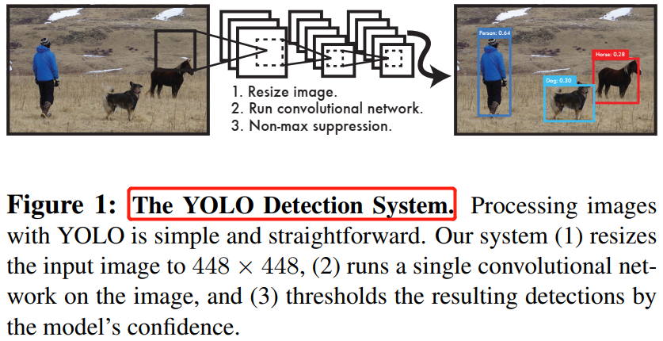

- [一，YOLOv1](#一yolov1)
  - [Abstract](#abstract)
  - [1. Introduction](#1-introduction)
  - [2. Unified Detectron](#2-unified-detectron)
    - [2.1. Network Design](#21-network-design)
    - [2.2 Training](#22-training)
    - [2.4. Inferences](#24-inferences)
    - [4.1 Comparison to Other Real-Time Systems](#41-comparison-to-other-real-time-systems)
- [二，YOLOv2](#二yolov2)
  - [Abstract](#abstract-1)
- [参考资料](#参考资料)

## 一，YOLOv1
YOLOv1 出自 2016 CVPR 论文 You Only Look Once:Unified, Real-Time Object Detection.

### Abstract

作者提出了一种新的目标检测方法 `YOLO`，之前的目标检测工作都是重新利用分类器来执行检测。作者的神经网络模型是端到端的检测，一次运行即可同时得到所有目标的边界框和类别概率。

`YOLO` 架构的速度是非常快的，`base` 版本实时帧率为 `45` 帧，`smaller` 版本能达到每秒 `155` 帧，性能由于 `DPM` 和 `R-CNN` 等检测方法。

### 1. Introduction

之前的目标检测器是重用分类器来执行检测，为了检测目标，这些系统在图像上不断遍历一个框，并利用分类器去判断这个框是不是目标。像可变形部件模型（`DPM`）使用互动窗口方法，其分类器在整个图像的均匀间隔的位置上运行。

**作者将目标检测看作是单一的回归问题，直接从图像像素得到边界框左边和类别概率**。

YOLO 检测系统如图 1 所示。单个检测卷积网络可以同时预测多个目标的边界框和类别概率。`YOLO` 和传统的目标检测方法相比有诸多优点。

首先，`YOLO` 速度非常快，我们将检测视为**回归**问题，所以检测流程也简单。其次，`YOLO` 在进行预测时，会对图像进行全面地推理。第三，`YOLO` 模型具有泛化能力，其比 `DPM` 和`R-CNN` 更好。最后，虽然 `YOLO` 模型在精度上依然落后于最先进（state-of-the-art）的检测系统，但是其速度更快。

### 2. Unified Detectron

`YOLO` 系统将输入图像划分成 $S\times S$ 的网格（`grid`），然后让每个`gird` 负责检测那些中心点落在 `grid` 内的目标。

**检测任务**：每个网络都会预测 $B$ 个边界框及边界框的置信度分数，所谓置信度分数其实包含两个方面：一个是边界框含有目标的可能性，二是边界框的准确度。前者记为 $Pr(Object)$，当边界框包含目标时，$Pr(Object)$ 值为 `1`，否则为 `0`；后者记为 $IOU^{truth}_{pred}$，即预测框与真实框的 `IOU`。因此形式上，我们将置信度定义为 $Pr(Object)*IOU^{truth}_{pred}$。如果 `grid` 不存在目标，则置信度分数置为 `0`，否则，置信度分数等于预测框和真实框之间的交集（`IoU`）。

每个边界框（`bounding box`）包含 `5` 个预测变量：$x$，$y$，$w$，$h$ 和 `confidence`。$(x,y)$ 坐标表示边界框相对于网格单元边界框的中心。而边界框的宽度和高度是相对于整个图片的宽与高的比例，因此理论上以上 `4` 预测量都应该在 $[0,1]$ 范围之内。最后，置信度预测表示预测框与实际边界框之间的 `IOU`。
> 值得注意的是，中心坐标的预测值 $(x,y)$ 是相对于每个单元格左上角坐标点的偏移值，单位也是相对于单元格大小的。

**分类任务**：每个网格单元（`grid`）还会预测 $C$ 个类别的概率 $Pr(Class_i)|Object)$。`grid` 包含目标时才会预测 $Pr$，且只预测一组类别概率，而不管边界框 $B$ 的数量是多少。

在推理时，我们乘以条件概率和单个 `box` 的置信度。

$$Pr(Class_i)|Object)*Pr(Object)*IOU^{truth}_{pred} = Pr(Class_i)*IOU^{truth}_{pred}$$

它为我们提供了每个框特定类别的置信度分数。这些分数编码了该类出现在框中的概率以及预测框拟合目标的程度。

在 `Pscal VOC` 数据集上评测 `YOLO` 模型时，我们设置 $S=7$, $B=2$（即每个 `grid` 会生成 `2` 个边界框）。`Pscal VOC` 数据集有 `20` 个类别，所以 $C=20$。所以，模型最后预测的张量维度是 $7 \times 7\times (20+5*2) = 1470$。

**总结**：`YOLO` 系统将检测建模为回归问题。它将图像分成 $S \times S$ 的 `gird`，每个 `grid` 都会预测 $B$ 个边界框，同时也包含 $C$ 个类别的概率，这些预测对应的就是 $S \times S \times (C + 5*B)$。

#### 2.1. Network Design

`YOLO` 模型使用卷积神经网络来实现，卷积层负责从图像中提取特征，全连接层预测输出类别概率和坐标。

`YOLO` 的网络架构受 `GooLeNet` 图像分类模型的启发。网络有 `24` 个卷积层，最后面是 `2` 个全连接层。整个网络的卷积只有 $1 \times 1$ 和 $3 \times 3$ 卷积层，其中 $1 \times 1$ 卷积负责降维 ，而不是 `GoogLeNet` 的 `Inception` 模块。

**图3：网络架构**。作者在 `ImageNet` 分类任务上以一半的分辨率（输入图像大小 $224\times 224$）训练卷积层，但预测时分辨率加倍。

`Fast YOLO` 版本使用了更少的卷积，其他所有训练参数及测试参数都和 `base YOLO` 版本是一样的。

网络的最终输出是 $7\times 7\times 30$ 的张量。这个张量所代表的具体含义如下图所示。对于每一个单元格，前 `20` 个元素是类别概率值，然后 `2` 个元素是边界框置信度，两者相乘可以得到**类别置信度**，最后 `8` 个元素是边界框的 $(x,y,w,h)$ 。之所以把置信度 $c$ 和 $(x,y,w,h)$ 都分开排列，而不是按照$(x,y,w,h,c)$ 这样排列，存粹是为了后续计算时方便。

> 划分 $7 \times 7$ 网格，共 `98` 个边界框，`2` 个框对应一个类别，所以 `YOLOv1` 只能在一个网格中检测出一个目标、最多预测 `49` 个目标。

#### 2.2 Training

> 模型训练最重要的无非就是超参数的调整和损失函数的设计。

因为 `YOLO` 算法将检测问题看作是回归问题，所以自然地采用了比较容易优化的均方误差作为损失函数，但是面临定位误差和分类误差权重一样的问题；同时，在每张图像中，许多网格单元并不包含对象，即负样本（不包含物体的网格）远多于正样本（包含物体的网格），这通常会压倒了正样本的梯度，导致训练早期模型发散。

为了改善这点，引入了两个参数：$\lambda_{coord}=5$ 和 $\lambda_{noobj} =0.5$。对于边界框坐标预测损失（定位误差），采用较大的权重 $\lambda_{coord}  =5$，然后区分不包含目标的边界框和含有目标的边界框，前者采用较小权重 $\lambda_{noobj} =0.5$。其他权重则均设为 `0`。

对于大小不同的边界框，因为较小边界框的坐标误差比较大边界框要更敏感，所以为了部分解决这个问题，将网络的边界框的宽高预测改为对其平方根的预测，即预测值变为 $(x, y, \sqrt w, \sqrt h)$。

YOLO 每个网格单元预测多个边界框。在训练时，每个目标我们只需要一个边界框预测器来负责。我们指定一个预测器“负责”根据哪个预测与真实值之间**具有当前最高的 `IOU` 来预测目标**。这导致边界框预测器之间的专业化。每个预测器可以更好地预测特定大小，方向角，或目标的类别，从而改善整体召回率。

> `YOLO` 由于每个网格仅能预测 `2` 个边界框且仅可以包含一个类别，因此是对于一个单元格存在多个目标的问题，`YOLO` 只能选择一个来预测。这使得它在预测临近物体的数量上存在不足，如钢筋、人脸和鸟群检测等。

最终网络总的损失函数计算公式如下：

$I_{ij}^{obj}$ 指的是第 $i$ 个单元格存在目标，且该单元格中的第 $j$ 个边界框负责预测该目标。 $I_{i}^{obj}$ 指的是第 $i$ 个单元格存在目标。

+ 前 2 行计算前景的 `geo_loss`（定位 `loss`）。
+ 第 3 行计算前景的 `confidence_loss`（包含目标的边界框的置信度误差项）。
+ 第 4 行计算背景的 `confidence_loss`。
+ 第 5 行计算分类损失 `class_loss`。

值得注意的是，对于不存在对应目标的边界框，其误差项就是只有置信度，坐标项误差是没法计算的。而只有当一个单元格内确实存在目标时，才计算分类误差项，否则该项也是无法计算的。

#### 2.4. Inferences

同样采用了 `NMS` 算法来抑制多重检测，细节后续补充代码。

#### 4.1 Comparison to Other Real-Time Systems

基于 GPU Titan X 硬件环境下，与他检测算法的性能比较如下。

## 二，[YOLOv2](http://xxx.itp.ac.cn/pdf/1612.08242.pdf)
> `YOLO9000` 是 `CVPR2017` 的最佳论文提名，但是这篇论文其实提出了 `YOLOv2` 和 `YOLO9000` 两个模型，二者略有不同。前者主要是 `YOLO` 的升级版，后者的主要检测网络也是 `YOLOv2`，同时对数据集做了融合，使得模型可以检测 `9000` 多类物体。

### Abstract

`YOLOv2` 其实就是 `YOLO9000`，作者在 `YOLOv1` 基础上改进的一种新的 `state-of-the-art` 目标检测模型，它能检测多达 `9000` 个目标！利用了多尺度（`multi-scale`）训练方法，`YOLOv2` 可以在不同尺寸的图片上运行，并取得速度和精度的平衡。

在速度达到在 `40 FPS` 同时，`YOLOv2` 获得 `78.6 mAP` 的精度，性能优于`backbone` 为 `ResNet` 的 `Faster RCNN` 和 `SSD` 等当前最优（`state-of-the-art`） 模型。最后作者提出一种联合训练目标检测和分类的方法，基于这种方法，`YOLO9000` 能实时检测多达 `9000` 种目标。

`YOLOv1` 虽然速度很快，但是还有很多缺点：

+ 虽然每个 `grid` 预测两个框，但是只能对应一个目标，对于同一个 `grid` 有着两个目标的情况下，`YOLOv` 是检测不全的，且模型最多检测 $7 \times 7 = 49$ 个目标，即表现为模型查全率低。
+ 预测框不够准确，之前回归 $(x,y,w,h)$ 的方法不够精确，即表现为模型精确率低。
+ 回归参数网络使用全连接层参数量太大，即模型检测头还不够块。

## 参考资料

+ [你一定从未看过如此通俗易懂的YOLO系列(从v1到v5)模型解读 (上)](https://zhuanlan.zhihu.com/p/183261974?utm_source=wechat_session&utm_medium=social&utm_oi=737449911926140928)
+ [目标检测|YOLO原理与实现](https://zhuanlan.zhihu.com/p/32525231)
+ [YOLO论文翻译——中英文对照](http://noahsnail.com/2017/08/02/2017-08-02-YOLO%E8%AE%BA%E6%96%87%E7%BF%BB%E8%AF%91%E2%80%94%E2%80%94%E4%B8%AD%E8%8B%B1%E6%96%87%E5%AF%B9%E7%85%A7/)

