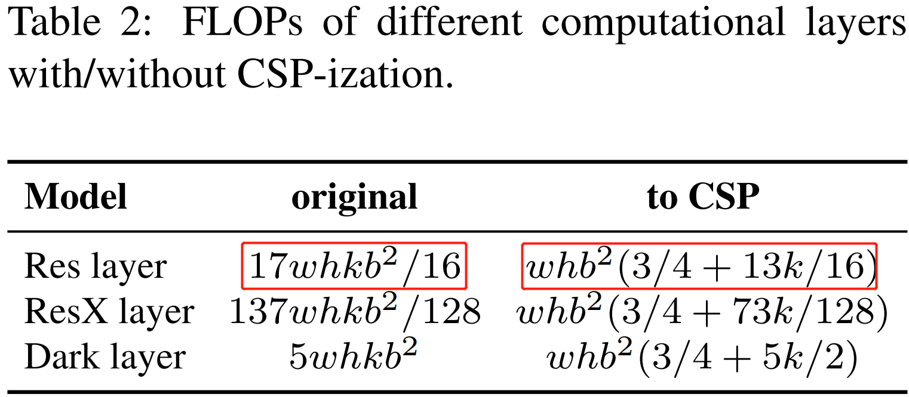

- [1，Scaled YOLOv4](#1scaled-yolov4)
  - [总结](#总结)
- [参考资料](#参考资料)

## 1，Scaled YOLOv4

> `Scaled YOLOv4` 的二作就是 `YOLOv4` 的作者 `Alexey Bochkovskiy`。

实验结果表明，基于 `CSP` 方法的 `YOLOv4` 目标检测模型在保持最优速度和准确率的前提下，同时也具有向上/向下可伸缩性，可用于不同大小的网络。由此，作者提出了一种网络缩放方法，它不仅改变深度、宽度、分辨率，而且还改变网络的结构。

**主要工作**。`Scaled YOLOv4` 的主要工作如下：

- 设计了一种针对小模型的强大的模型缩放方法，系统地平衡了浅层 `CNN` 的计算代价和存储带宽;
- 设计一种简单有效的大型目标检测器**缩放策略**;
- 分析各模型缩放因子之间的关系，基于最优组划分进行模型缩放;
- 实验证实了 `FPN` 结构本质上是一种 `once-for-all` 结构;
- 利用上述方法研制了 `YOLOv4-tiny` 和 `YOLO4v4-large` 模型。

**模型缩放**。传统的模型缩放是指改变模型的深度，如 `VGG` 变体，以及后边可以训练更深层的 `ResNet` 网络等；后面 `agoruyko` 等人开始考虑模型的宽度，通过改变卷积层卷积核的数量来实现模型缩放，并设计了 `Wide ResNet`，同样的精度下，它的参数量尽管比原始 `ResNet` 多，但是推理速度却更快。随后的 `DenseNet` 和 `ResNeXt` 也设计了一个复合缩放版本，将深度和宽度都考虑在内。

**模型缩放原则**。
> 这段内容，原作者的表达不严谨，计算过程也没有细节，所以我不再针对原文进行一一翻译，而是在原文的基础上，给出更清晰的表达和一些计算细节。

这里，我们得先知道对一个卷积神经网络来说，其模型一般是由 `conv stage`、`conv block`、`conv layer` 组成的。我以 `ResNet50` 为例进行分析，大家就能明白了。`ResNet50` 的卷积过程分成 `4` 个 `stage`，分别对应的卷积 `blocks` 数目是 $[3,4,6,3]$，卷积 `block` 是 `bottleneck` 残差单元，`bottleneck` 残差单元又是 $1\times 1$、$3\times 3$ 和 $1\times 1$ 这样 `3` 个卷积层组成的，所以 `ResNet50` 总共的卷积层数目为：$3\times 3 + 4\times 3+ 6\times 3 + 3\times 3 = 48$，再加上第一层的卷积和最后一层的分类层（全连接层），总共是 `50` 层，所以命名为 `ResNet50`。`ResNet` 模型的组成和结构参数表如下图所示。
> 大部分 `backbone` 都是分成 `4` 个 `stage`。

对一个基础通道数是 $b$ 的卷积模块（`conv block`），总共有 $k$ 个这样的模块的 `CNN` 网络来说，其计算代价是这样的。如 `ResNet` 的总的卷积层的计算量为 $k\ast [conv(1\times 1,b/4)\rightarrow conv(3\times 3,b/4)\rightarrow conv(1\times 1,b)]$；`ResNeXt` 的总的卷积层的计算量为 $k\ast [conv(1\times 1,b/2)\rightarrow gconv(3\times 3/32, b/2)\rightarrow conv(1\times 1, b)]$；`Darknet` 网络总的计算量为 $k\ast [conv(1\times 1,b/2)\rightarrow conv(3\times 3, b)]$。假设可用于调整图像大小、层数和通道数的缩放因子分别为 $\alpha$、$\beta$ 和 $\gamma$。当调整因子变化时，可得出它们和 `FLOPs` 的关系如下表所示。

这里以 `Res layer` 为例，进行计算量分析。首先上表的 $r$ 应该是指每个 `stage` 中间的残差单元，而且还是 `bottleneck` 残差单元，因为只有 `stage` 中间的 `bottleneck conv block` 的第一个 $1\times 1$ 卷积层的输入通道数才是输出通道数的 `4` 倍，只有这种情况算出来的计算量 $r$ 才符合表 `1` 的结论。

卷积层 `FLOPs` 的计算公式如下，这里把乘加当作一次计算，公式理解请参考我之前写的 [文章](../../7-model_deploy/B-神经网络模型复杂度分析.md)。

$FLOPs=(C_i\times K^2)\times H\times W\times C_o$

对于上面说的那个特殊的 `bottleneck conv block` 来说，卷积过程特征图大小没有发生变化，假设特征图大小为 $wh$，所以 `bolck` 的 `FLOPs` 为：

$$\begin{align*}
r1 &=  (b \times 1^2\times \frac{b}{4} + \frac{b}{4} \times 3^2\times \frac{b}{4} + \frac{b}{4} \times 1^2\times b)\times hw \\\\
&= \frac{17}{16}whb^2
\end{align*}$$

这里值得注意的是，虽然各个 `conv block` 会略有不同，比如 每个 `conv stage` 的第一个 `conv block` 都会将特征图缩小一倍，但是其 `FLOPs` 和 $r1$ 是线性的关系，所以，对于有 $k$ 个 `conv block` 的 `ResNet` 来说，其总的计算量自然就可大概近似为 $17whkb^2/16$。`ResNeXt` 和 `Darknet` 卷积层的 `FLOPs` 计算过程类似，所以不再描述。

由表 `1` 可以看出，**图像大小、深度和宽度都会导致计算代价的增加，它们分别成二次，线性，二次增长**。

`Wang` 等人提出的 [CSPNet](../../5-deep_learning/轻量级网络论文解析/CSPNet%20论文详解.md) 可以应用于各种 `CNN` 架构，同时减少了参数和计算量。此外，它还提高了准确性，减少了推理时间。作者把它应用到 `ResNet, ResNeXt，DarkNet` 后，发现计算量的变化如表 `2` 所示。

`CNN` 转换为 `CSPNet` 后，新的体系结构可以有效地减少 `ResNet`、`ResNeXt` 和 `Darknet` 的计算量（`FLOPs`），分别减少了 `23.5%`、`46.7%` 和 `50.0%`。因此，作者**使用 `CSP-ized` 模型作为执行模型缩放的最佳模型**。

`anchor-free` 的方法，如 `centernet` 是不需要复杂的后处理，如 `NMS`。`Backbone` 模型的宽度、深度、模块的瓶颈比（`bottleneck`）、输入图像分辨率等参数的关系。

**模型结构**。`Sacled-YOLOv4` `large` 版本的模型结构图，如下图所示。

### 总结

通篇论文看下来，感觉最主要的贡献在于通过理论和实验证了模型缩放的原则，进一步拓展了 `CSPNet` 方法，并基于此设计了一个全新的 `Scaled-YOLOv4`，`Scaled-YOLOv4` 网络的卷积模块都是使用了 `CSP` 方法构造的。

## 参考资料

+ 