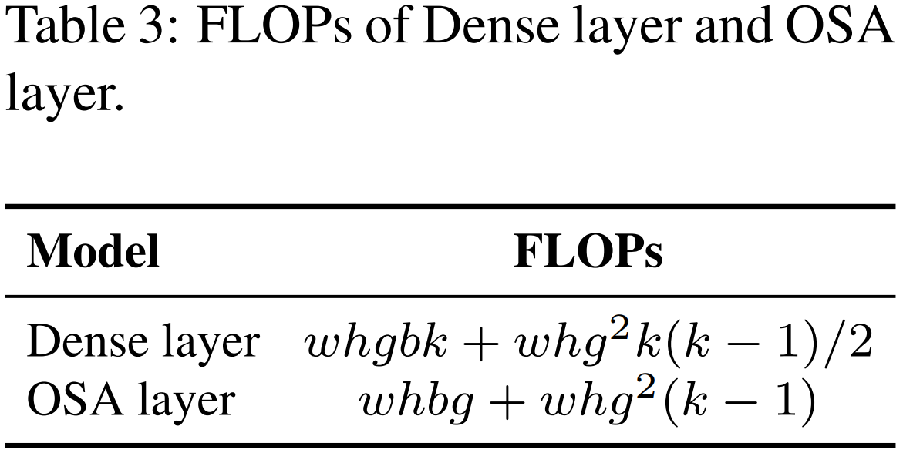
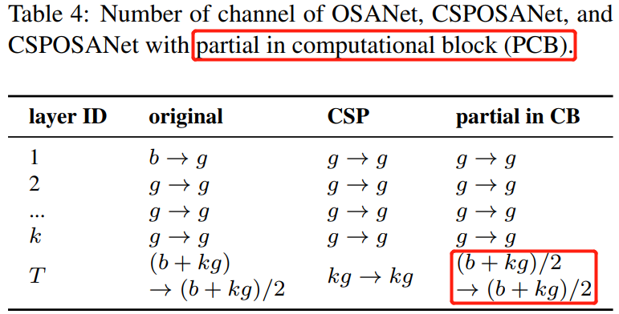
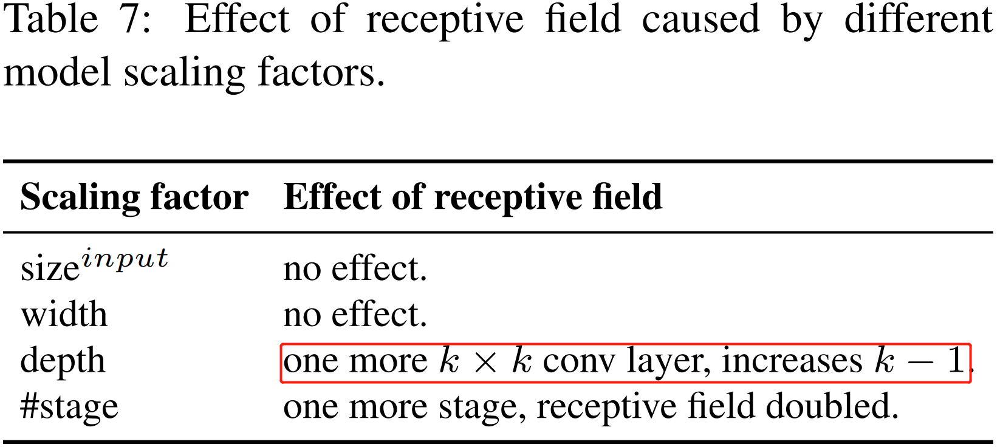
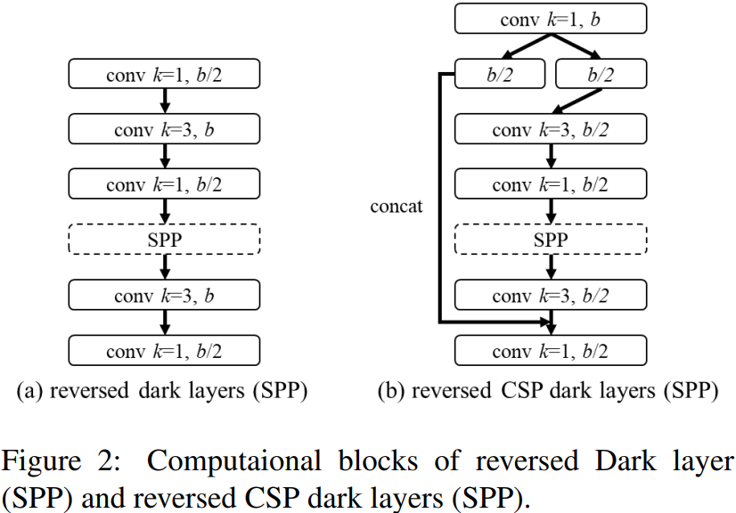

- [一，Scaled YOLOv4](#一scaled-yolov4)
  - [1，介绍](#1介绍)
  - [2，相关工作](#2相关工作)
    - [2.1，模型缩放](#21模型缩放)
  - [3，模型缩放原则](#3模型缩放原则)
    - [3.1，模型缩放的常规原则](#31模型缩放的常规原则)
    - [3.2，为低端设备缩放的tiny模型](#32为低端设备缩放的tiny模型)
    - [3.3，为高端设备缩放的Large模型](#33为高端设备缩放的large模型)
  - [4，Scaled-YOLOv4](#4scaled-yolov4)
    - [4.1，CSP-ized YOLOv4](#41csp-ized-yolov4)
    - [4.2，YOLOv4-tiny](#42yolov4-tiny)
    - [4.3，YOLOv4-large](#43yolov4-large)
  - [5，实验](#5实验)
  - [总结](#总结)
- [参考资料](#参考资料)

## 一，Scaled YOLOv4

> `Scaled YOLOv4` 的二作就是 `YOLOv4` 的作者 `Alexey Bochkovskiy`。

### 1，介绍

实验结果表明，基于 `CSP` 方法的 `YOLOv4` 目标检测模型在保持最优速度和准确率的前提下，同时也具有向上/向下可伸缩性，可用于不同大小的网络。由此，作者提出了一种网络缩放方法，它不仅改变深度、宽度、分辨率，而且还改变网络的结构。

**主要工作**。`Scaled YOLOv4` 的主要工作如下：

- 设计了一种针对小模型的强大的模型缩放方法，系统地平衡了浅层 `CNN` 的计算代价和存储带宽;
- 设计一种简单有效的大型目标检测器**缩放策略**;
- 分析各模型缩放因子之间的关系，基于最优组划分进行模型缩放;
- 实验证实了 `FPN` 结构本质上是一种 `once-for-all` 结构;
- 利用上述方法研制了 `YOLOv4-tiny` 和 `YOLO4v4-large` 模型。

以往模型缩放，如 `EfficientDet` 无非是首先选择网络基础模块，它往往又好又快，然后针对影响目标检测的重要参数如：网络宽度 $w$、深度 $d$、输入图像分辨率`size` 等进行（满足一定条件下按照一定规律）调参，或者 `NAS` 自动调参。

### 2，相关工作

#### 2.1，模型缩放

传统的模型缩放是指改变模型的深度，如 `VGG` 变体，以及后边可以训练更深层的 `ResNet` 网络等；后面 `agoruyko` 等人开始考虑模型的宽度，通过改变卷积层卷积核的数量来实现模型缩放，并设计了 `Wide ResNet`，同样的精度下，它的参数量尽管比原始 `ResNet` 多，但是推理速度却更快。随后的 `DenseNet` 和 `ResNeXt` 也设计了一个复合缩放版本，将深度和宽度都考虑在内。

### 3，模型缩放原则

#### 3.1，模型缩放的常规原则

> 这段内容，原作者的表达不够严谨，计算过程也没有细节，所以我不再针对原文进行一一翻译，而是在原文的基础上，给出更清晰的表达和一些计算细节。

这里，我们得先知道对一个卷积神经网络来说，其模型一般是由 `conv stage`、`conv block`、`conv layer` 组成的。我以 `ResNet50` 为例进行分析，大家就能明白了。`ResNet50` 的卷积过程分成 `4` 个 `stage`，分别对应的卷积 `blocks` 数目是 $[3,4,6,3]$，卷积 `block` 是 `bottleneck` 残差单元，`bottleneck` 残差单元又是 $1\times 1$、$3\times 3$ 和 $1\times 1$ 这样 `3` 个卷积层组成的，所以 `ResNet50` 总共的卷积层数目为：$3\times 3 + 4\times 3+ 6\times 3 + 3\times 3 = 48$，再加上第一层的卷积和最后一层的分类层（全连接层），总共是 `50` 层，所以命名为 `ResNet50`。`ResNet` 模型的组成和结构参数表如下图所示。
> 大部分 `backbone` 都是分成 `4` 个 `stage`。

对一个基础通道数是 $b$ 的卷积模块（`conv block`），总共有 $k$ 个这样的模块的 `CNN` 网络来说，其计算代价是这样的。如 `ResNet` 的总的卷积层的计算量为 $k\ast [conv(1\times 1,b/4)\rightarrow conv(3\times 3,b/4)\rightarrow conv(1\times 1,b)]$；`ResNeXt` 的总的卷积层的计算量为 $k\ast [conv(1\times 1,b/2)\rightarrow gconv(3\times 3/32, b/2)\rightarrow conv(1\times 1, b)]$；`Darknet` 网络总的计算量为 $k\ast [conv(1\times 1,b/2)\rightarrow conv(3\times 3, b)]$。假设可用于调整图像大小、层数和通道数的缩放因子分别为 $\alpha$、$\beta$ 和 $\gamma$。当调整因子变化时，可得出它们和 `FLOPs` 的关系如下表所示。

这里以 `Res layer` 为例，进行计算量分析。首先上表的 $r$ 应该是指每个 `stage` 中间的残差单元，而且还是 `bottleneck` 残差单元，因为只有 `stage` 中间的 `bottleneck conv block` 的第一个 $1\times 1$ 卷积层的输入通道数才是输出通道数的 `4` 倍，只有这种情况算出来的计算量 $r$ 才符合表 `1` 的结论。

卷积层 `FLOPs` 的计算公式如下，这里把乘加当作一次计算，公式理解请参考我之前写的 [文章](../../7-model_deploy/B-神经网络模型复杂度分析.md)。

$FLOPs=(C_i\times K^2)\times H\times W\times C_o$

对于上面说的那个特殊的 `bottleneck conv block` 来说，卷积过程特征图大小没有发生变化，假设特征图大小为 $wh$，所以 `bolck` 的 `FLOPs` 为：

$$\begin{align*}
r1 &=  (b \times 1^2\times \frac{b}{4} + \frac{b}{4} \times 3^2\times \frac{b}{4} + \frac{b}{4} \times 1^2\times b)\times hw \\\\
&= \frac{17}{16}whb^2
\end{align*}$$

这里值得注意的是，虽然各个 `conv block` 会略有不同，比如 每个 `conv stage` 的第一个 `conv block` 都会将特征图缩小一倍，但是其 `FLOPs` 和 $r1$ 是线性的关系，所以，对于有 $k$ 个 `conv block` 的 `ResNet` 来说，其总的计算量自然就可大概近似为 $17whkb^2/16$。`ResNeXt` 和 `Darknet` 卷积层的 `FLOPs` 计算过程类似，所以不再描述。

由表 `1` 可以看出，**图像大小、深度和宽度都会导致计算代价的增加，它们分别成二次，线性，二次增长**。

`Wang` 等人提出的 [CSPNet](../../5-deep_learning/轻量级网络论文解析/CSPNet%20论文详解.md) 可以应用于各种 `CNN` 架构，同时减少了参数和计算量。此外，它还提高了准确性，减少了推理时间。作者把它应用到 `ResNet, ResNeXt，DarkNet` 后，发现计算量的变化如表 `2` 所示。

`CNN` 转换为 `CSPNet` 后，新的体系结构可以有效地减少 `ResNet`、`ResNeXt` 和 `Darknet` 的计算量（`FLOPs`），分别减少了 `23.5%`、`46.7%` 和 `50.0%`。因此，作者**使用 `CSP-ized` 模型作为执行模型缩放的最佳模型**。

#### 3.2，为低端设备缩放的tiny模型

对于低端设备，设计模型的推理速度不仅受到计算量和模型大小的影响，更重要的是必须考虑外围硬件资源的限制。因此，在执行 `tiny` 模型缩放时，我们必须考虑以下因素：内存带宽、内存访问代价（`MACs`）和 `DRAM traffic`。为了考虑到以上因素，我们的设计必须遵循以下原则：

1，**使计算复杂度少于 $O(whkb^2)$**。

作者分析了高效利用参数的网络：`DenseNet` 和 `OSANet` 的计算量，分别为 $O(whgbk)$、$O(max(whbg, whkg^2))$。两者的计算复杂度阶数均小于 `ResNet` 系列的 $O(whkb^2)$。因此，我们基于 `OSANet` 设计 `tiny` 模型，因为它具有更小的计算复杂度。
> 这里的 `OSANet` 其实是 [VoVNet](http://xxx.itp.ac.cn/pdf/1904.09730.pdf) 网络，专门为 `GPU` 平台设计的更高效的 `backbone` 网络架构。

2，**最小化/平衡 feature map 的大小**
> 说实话，没看明白论文这段内容，这不是跟论文 `CSPNet` 一样的结论吗，即分割为通道数相等的两条路径。

为了获得在计算速度方面的最佳平衡，我们提出了一个新概念：在`CSPOSANet` 的计算块之间执行**梯度截断**。如果我们将原来的 `CSPNet` 设计应用到 `DenseNet` 或 `ResNet` 架构上，由于这两种架构的第 $j$ 层输出是第 $1^{st}$ 层到第$(j-1)^{th}$ 层输出的积分，我们必须将整个计算块作为一个整体来处理。由于 `OSANet` 的计算块属于 `PlainNet` 架构，从计算块的任意层制作 `CSPNet` 都可以达到梯度截断的效果。我们利用该特性对基层的 $b$ 通道和计算块（`computational block`）生成的 $kg$ 通道进行重新规划，**并将其分割为通道数相等的两条路径**，如表 `4` 所示。

当通道数量为 $b + kg$ 时，如果要将这些通道分割成两条路径，最好将其分割成相等的两部分，即 $(b + kg)/2$。

3，**在卷积后保持相同的通道数**

评估低端设备的计算成本，必须考虑功耗，而影响功耗的最大因素是内存访问代价（$MAC$）。根据 `Shufflenetv2` 的推导证明，可知卷积层的输入输出通道数相等时，即 $C_{in} = C_{out}$ 时， $MAC$ 最小。

4，**最小化卷积输入/输出(CIO)**

`CIO` 是一个可以测量 `DRAM IO` 状态的指标。表 `5` 列出了 `OSA`、`CSP` 和我们设计的 `CSPOSANet` 的 `CIO`。当$kg > b/2$ 时，`CSPOSANet` 可以获得最佳的 `CIO`。

#### 3.3，为高端设备缩放的Large模型

`feature pyramid network` (`FPN`)的架构告诉我们，更高的 `stage` 更适合预测大的物体。表 `7` 说明了感受野与几个参数之间的关系。

从表 `7` 可以看出，宽度缩放可以独立操作。当输入图像尺寸增大时，要想对大对象有更好的预测效果，就必须增大网络的 `depth` 或 `stage` （一般每个 `stage` 都会降低特征图分辨率的一半）的数量。在表 `7` 中列出的参数中，$\{size^{input}， \#stage\}$ 的组合效果最好。因此，当执行缩放时，我们首先在 $\{size^{input}，\#stage\}$ 上执行复合缩放，然后根据实时的环境，我们再分别进一步缩放深度 `depth` 和宽度 `width`。

### 4，Scaled-YOLOv4

#### 4.1，CSP-ized YOLOv4

`YOLOv4` 是为通用 `GPU` 上的实时目标检测而设计的。

1，**Backbone**

为了获得更好的速度/精度权衡，我们将第一个 `CSP` 阶段转换为原始的 `DarkNet` 的残差层。
> 没能理解这段内容。

2，**Neck**

3，**SPP**

#### 4.2，YOLOv4-tiny

`YOLOv4-tiny` 是为低端 `GPU` 设备设计的，设计将遵循 `3.2` 节中提到的原则。

我们将使用 `PCB`（`partial in computational block`） 架构的 `CSPOSANet` 作为 `YOLOv4` `backbone`。我们设 $g = b/2$ 为增长率，最终使其增长到 $b/2 + kg = 2b$。通过计算，我们得到 $k = 3$。`YOLOv4` 的卷积块（`computational block`）结构如图 `3` 所示。对于每个阶段的通道数量和 `neck` 网络结构，我们采用 `YOLOv3-tiny` 一样的设计。

#### 4.3，YOLOv4-large

专门为云端 `GPU` 设计的，主要目的就是为实现高精度的目标检测。我们设计了一个完全 `CSP` 化的模型 `YOLOv4-P5`，并将其扩展到 `YOLOv4-P6` 和 `YOLOv4-P7`。`Sacled-YOLOv4` `large` 版本的模型结构图，如下图所示。

我们通过设计 $size^{input}$, #stage 来对 `backbone` 执行复合缩放。我们把每个 `stage` 的深度设置为 $2^{d_{s_{i}}}$。$d_s$ 范围为 $[1, 3, 15, 15, 7, 7, 7]$。与之前的 `ResNet` 的卷积划分为 `4` 个 `stage` 不同，这里最多划分为 `7` 个 `stage`（`YOLOv4-P7`）。

### 5，实验

与其他实时目标检测检测器进行比较，对比实验结果如表 `11` 所示。

### 总结

通篇论文看下来，感觉最主要的贡献在于通过理论系统分析和实验证了模型缩放的原则，进一步拓展了 `CSPNet` 方法，并基于此设计了一个全新的 `Scaled-YOLOv4`，`Scaled-YOLOv4` 网络的卷积模块都有使用 `CSP`。总的感觉就是针对不同的 `GPU` 平台，根据作者分析出来的模型缩放理论，且符合一些原则的情况下，选择不同的模型宽度和深度参数，并，让模型更深更宽。

> `anchor-free` 的方法，如 `centernet` 是不需要复杂的后处理，如 `NMS`。`Backbone` 模型的宽度、深度、模块的瓶颈比（`bottleneck`）、输入图像分辨率等参数的关系。

## 参考资料

- [Scaled-YOLOv4: Scaling Cross Stage Partial Network](https://arxiv.org/abs/2011.08036)
- [Scaled-YOLOv4: Scaling Cross Stage Partial Network 论文翻译](https://blog.csdn.net/Q1u1NG/article/details/109765162)