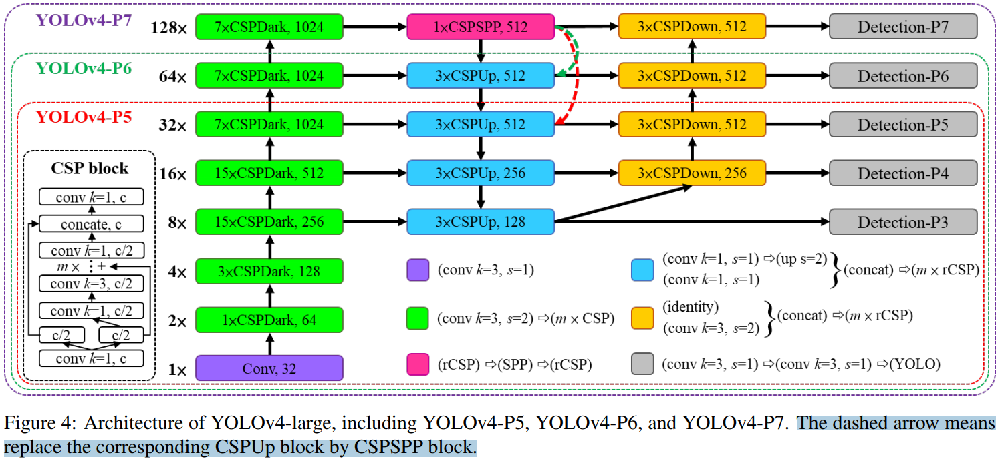

- [1，Scaled YOLOv4](#1scaled-yolov4)
    - [总结](#总结)
- [参考资料](#参考资料)

## 1，Scaled YOLOv4

> `Scaled YOLOv4` 的二作就是 `YOLOv4` 的作者 `Alexey Bochkovskiy`。

实验结果表明，基于 `CSP` 方法的 `YOLOv4` 目标检测模型在保持最优速度和准确率的前提下，同时也具有向上/向下可伸缩性，可用于不同大小的网络。由此，作者提出了一种网络缩放方法，它不仅改变深度、宽度、分辨率，而且还改变网络的结构。

**主要工作**。`Scaled YOLOv4` 的主要工作如下：

- 设计了一种针对小模型的强大的模型缩放方法，系统地平衡了浅层 `CNN` 的计算代价和存储带宽;
- 设计一种简单有效的大型目标检测器**缩放策略**;
- 分析各模型缩放因子之间的关系，基于最优组划分进行模型缩放;
- 实验证实了 `FPN` 结构本质上是一种 `once-for-all` 结构;
- 利用上述方法研制了 `YOLOv4-tiny` 和 `YOLO4v4-large` 模型。

**模型缩放**。传统的模型缩放是指改变模型的深度，如 `VGG` 变体，以及后边可以训练更深层的 `ResNet` 网络等；后面 `agoruyko` 等人开始考虑模型的宽度，通过改变卷积层卷积核的数量来实现模型缩放，并设计了 `Wide ResNet`，同样的精度下，它的参数量尽管比原始 `ResNet` 多，但是推理速度却更快。随后的 `DenseNet` 和 `ResNeXt` 也设计了一个复合缩放版本，将深度和宽度都考虑在内。

**模型缩放原则**。假设可用于调整图像大小、层数和通道数的缩放因子分别为 $\alpha$、$\beta$ 和 $\gamma$。

`anchor-free` 的方法，如 `centernet` 是不需要复杂的后处理，如 `NMS`。`Backbone` 模型的宽度、深度、模块的瓶颈比（`bottleneck`）、输入图像分辨率等参数的关系。

**模型结构**。`Sacled-YOLOv4` `large` 版本的模型结构图，如下图所示。

#### 总结

通篇论文看下来，感觉最主要的贡献在于通过理论和实验证了模型缩放的原则，进一步拓展了 `CSPNet` 方法，并基于此设计了一个全新的 `Scaled-YOLOv4`，`Scaled-YOLOv4` 网络的卷积模块都是使用了 `CSP` 方法构造的。

## 参考资料

+ 